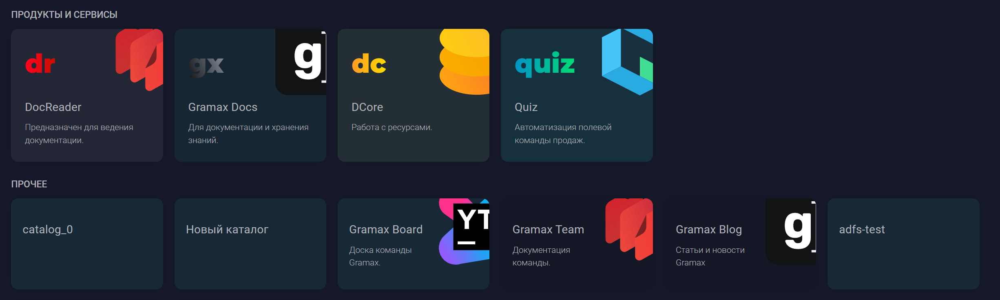
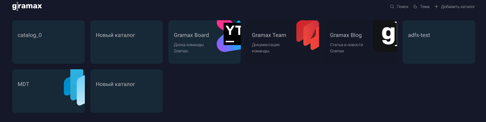

Сейчас у нас нет возможности использовать нестандартные группы для каталогов, можно использовать только захардкоженные группы (Продукты и Сервисы, Внутренняя документация , Проекты), нужно чтобы у пользователей была возможность использовать свои группы каталогов в докпортале.

## Критерии

-  Добавлен возможность использовать workspace’ы в приложении

   -  Если в `ROOT_PATH` , есть файл с названием `workspace.yaml` , то в приложении используются настройка главной страницы из `workspace.yaml` .

-  Добавлена возможность использовать workspace’ы в докпорталe.

   -  Обновлен публичный docker-compose, чтобы пользователи могли настраивать свои докпорталы.

      :::hotfixes:true Docker compose

      ```yaml
      services:
        gramax:
          image: gramax/gramax:latest
          container_name: gramax
          restart: unless-stopped
          ports:
            - ${PORT:-80}:80
          environment:
            - ADMIN_LOGIN=${ADMIN_LOGIN:-admin}
            - ADMIN_PASSWORD=${ADMIN_PASSWORD:-password}
            - AUTO_PULL_TOKEN=${AUTO_PULL_TOKEN:-}
            - AUTO_PULL_INTERVAL=${AUTO_PULL_INTERVAL:-}
          volumes:
            - ${ROOT_PATH:-./gramax}:/app/data
            - ${WORKSPACE_PATH:-./workspace.yaml}:/app/data/workspace.yaml
      ```

      :::

-  Тестовый докпортал использует workspace’ы в качестве источника групп для [alfa-ics-it.gram.ax](https://alfa-ics-it.gram.ax/).

-  Workspace - это  настройка главной страницы, в котором можно будет указать стили плашек для каталогов, группы каталогов.

   -  Настройки workspace'ов будут храниться в yaml формате.

      ```yaml
      groups:
       # products: # название группы
       #    title: Продукты и сервисы # заголовок группы
       #    style: big # стиль плашки каталогов, по умолчания `small`, варианты: `big`, `small`
      
       # company: # название группы
       #    title: Внутренняя документация # заголовок группы
      
       # projects: # название группы
       #    title: Проекты # заголовок группы
      ```

      :::hotfixes:true Описание параметров

      -  `groups` - группы каталогов на главной странице, группа задается в формате:

         -  `{group-key}` - это значение нужно будет указывать в каталогах, в параметре `group:{group-key}`, для того, чтобы каталог был в этой группе

            -  `title` - заголовок группы, если не указан, группа будет без заголовка

            -  `style` - стиль плашек каталогов группы, по умолчанию `small`

               -  При значении `big`

                  

               -  При значении `small`

                  

      :::

   -  Если у каталога нет значения `group` или такого `group-key` не существует, то такие каталоги будут помещены в группу `ПРОЧЕЕ`

      

   -  Если файл с workspace'ами не существует, то каталоги будут расположены без групп.

      

   -  Если группа не содержит в себе каталогов, то она не будет показываться на главной странице

## Оценка

-  Анализ -- 8ч

-  Реализация -- 12ч

## Техническая детали

Интерфейс workspace’ов

```
interface Group {
	title: string;
	style: "big" | "small";
}

interface Workspace {
	groups: Record<string, Group>[];
}
```