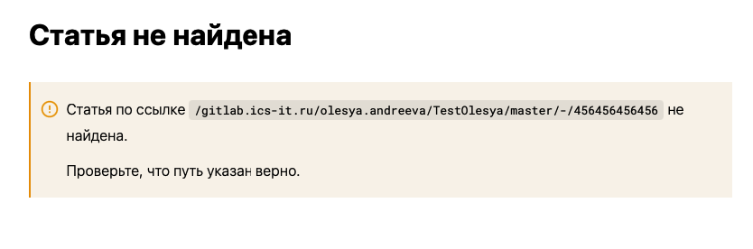

Сейчас, если перейти из каталога на главную или закрыть окно, приложение не запоминает, в какой статье находился пользователь. Поэтому потому ему приходится снова искать статью, с которой он работал до этого.

Нужно, чтобы при возвращении в каталог, пользователь попадал в статью, в которой он находился при выходе.

## Критерии

1. При первом открытии каталога, пользователь попадает на первую статью в нём

2. При последующих открытиях каталога, пользователь попадает на последнюю посещённую статью в каталоге

3. На главной странице, URL каталогов ведёт на последнюю статью, которую открывал пользователь

4. В случае, если статья, в который был пользователь, удалена, он попадает на первую статью в каталоге

## Оценка

Реализация: \~6ч

## Реализация

1. В `localStorage` хранится хешмапа `catalogName`\->`articleUrl`. При переходе между статьями, значение ключа `catalogName` обновляется.

2. После загрузки `Library`, приложение проверяет, что все каталоги из хешмапы существуют и удаляет лишние.

3. На `HomePage` карточки каталогов ссылаются в том числе на статью, а не просто на каталог.

## Замечания

-  \[x\]Если статья, в которой был пользователь, удалена, то не попадаем на первую статью в каталоге.

