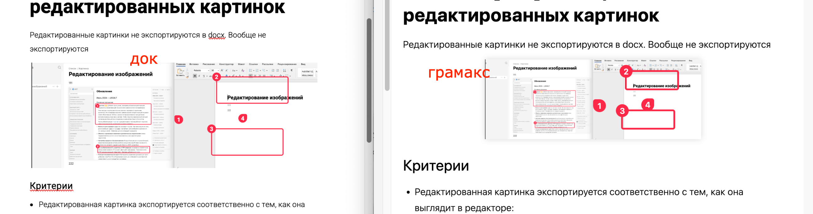
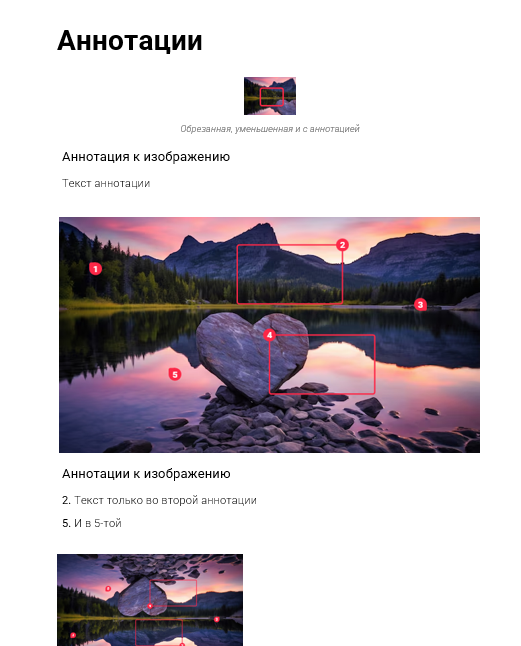
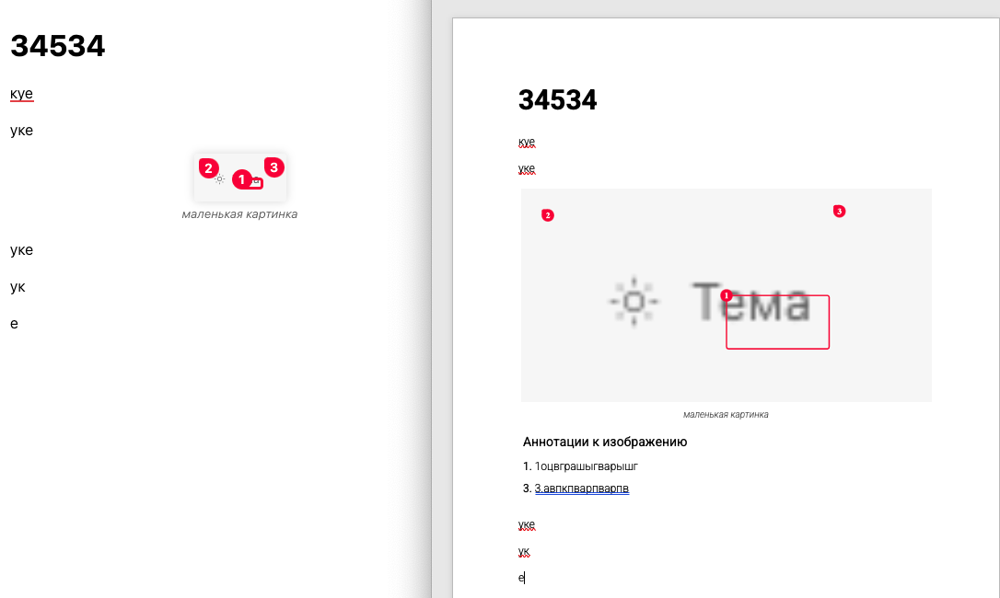

В Gramax можно изменить размер картинки -- например, сделать ее уже. Этот параметр сейчас не передается при экспорте в DOCX. Также неправильно выгружается ширина аннотаций.

## Критерии

-  Если в статье изменен размер картинки, при экспорте она также передается с настроенным размером.

-  Если на картинку добавлены аннотации и прямогольники, они также экспортируются в том виде, в котором отображаются в статье.

-  Текст аннотаций экспортируется списком, а также находиться в **специальном блоке**, основанном на таблице

-  “**Аннотация к изображению**” - новый стиль `Annotation Title`

-  Список имеет стиль параграфа `ListParagraph`, стиль знака `Normal`, но у чисел нумерации шрифт `Roboto`, а не `RobotoLight`

## Тесты

-  Отсутствуют

## Известные ограничения

-  текст сделать реальным списком не получится. библиотека не поддерживает ручную установку нумерации. Поэтому список сделать в виде обычного текста с нумерацией(список не является реальным списком)

## Замечания

-  \[x\] Маленькие картинки экспортируются в увеличенном размере, не сохраняется размер картинок.

   
