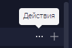

## Проблемы

-  В докпортале, теперь доступна кнопка троеточия, в котором есть тултип `Изменить`. Это название не соотетствует реальным действиям доступным в докпортале

-  Русский вариант `Изменить` не соотносится по переводу с `Actions` в английской версии

Было решено заменить русский вариант тултипа на `Действия`, так как это более универсальное слово, а также решает вышеуказанные проблемы

## Критерии

-  Теперь надпись тултипа `Действия`

