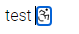

Сейчас у нас фокус работает таким образом, что при изменении позиции он сравнивает её с каждым узлом на странице, хотелось бы изменить это поведение. Так же курсор отображает неверный выделенный элемент у инлайновых элементов, и у расположенных рядом друг-с-другом блочных компонентов.

## Примеры

-  Иконки. Фокус отображается на иконке, а по факту слева от неё. (На скриншоте отображается и фокус, и outline -- это неверное поведение)

   

-  Блочные элементы. Если разместить два блочных элемента рядом друг-с-другом, то при переходе между ними, элемент выделится, но дополнительная панель не появится. (На скриншоте изображение выделено outline, но дополнительного меню нет)

   [image:./nv-al-open-izmenenie-povedenie-fokusa-3.png:::0,0,100,100:29:]

## Критерии

-  При переходе между элементами (блочными и инлайновыми) выделяется только тот, в котором стоит фокус (сейчас инлайновые выделяются, если курсор стоит слева от элемента)

-  Отображается горизонтальный курсор между блоковыми элементами

   [image:./nv-al-open-izmenenie-povedenie-fokusa.png:::0,0,100,100:square,2,34,14,61,Gapcursor,top-left]