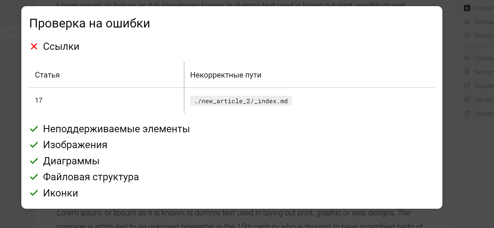

Сейчас ссылки с заголовком не проверяются в “Проверке на ошибки”, нужно добавить проверку.

### Критерии

-  В проверке на ошибки в разделе **Ссылки** отображаются некорректные относительные ссылки на заголовки.

-  Сам заголовок отображается в ссылке в “Некорректные пути” стандартным образом (через #).

:::info:true Проверка на ошибки

### 

:::