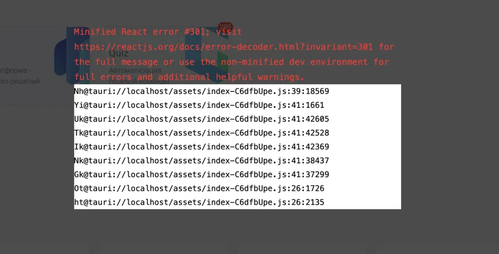
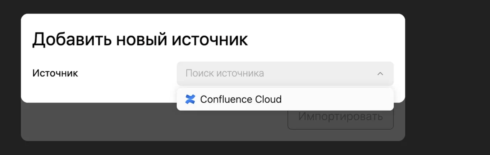

## Анализ

Необходимо добавить импорт для селф-хостед конфлюенса. Существующие конверторы не подходят. Преобразовывать придётся элементы из формата HTML. Список поддерживаемых элементов будет отличаться от Cloud версии.

Чтобы не было необходимости разрабатывать прокси сервис для импорта, сначала импорт будет доступен только из десктопа.

## Критерии

#### **Будет добавлен новый пункт в окно импорта**

-  Существующий способ импорта -> **Confluence Cloud**

-  Селф-хостед -> **Confluence self-hosted server (Одинаковая икона)**

#### **Пользователю необходимо будет ввести**

-  **Обновлено тут:** [Аутентификация токеном](./ez-autentifikaciya-tokenom-confluence-self-hoste)

Текст ошибки - **Модальное окно**. Не удалось подключиться. Пожалуйста, проверьте правильность введённых данных.

Как будет проходить проверка/добавление - по нажатию кнопки “Добавить”

#### Перенос

-  Переносяться:

   -  Простая текстовая информация

   -  Списки и таблицы

-  Не переносяться:

   -  Медиа файлы

   -  Элементы с логикой(макросы)

#### Известные ограничения

-  Информация между эмодзи на одной строке -- теряется

-  Список задач -- некорректно отображается вложенность списка

-  Применяется только один стиль к тексту(напр. *курсив* + **жирный** -> только один из стилей)

### Замечания

-  \[x\] В десктопе после добавления источника Confluence self-hosted server появляется ошибка.

   

-  \[-\] В браузере нет этого источника.

   

-  \[x\] В форме добавления нового источника Confluence self-hosted server ввела неправильные данные и при добавлении ошибка. [Запись экрана.mov](<./Запись экрана 2024-09-25 в 16.06.26.mov>)