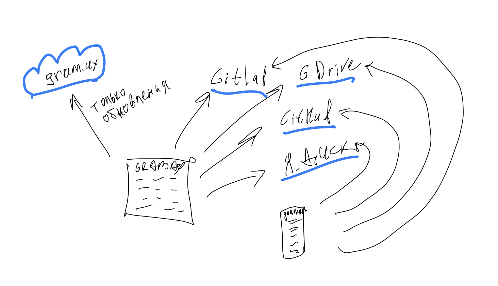

## Бесплатный редактор текста и докпорталов для it-проектов

Работайте совместно над документами в WYSIWYG или Markdown, контролируйте каждое изменение с помощью Git, используйте подход Docs as Code для совместной работы с коллегами и заказчиками.

Gramax -- это **бесплатный** текстовый редактор с простым визуальным интерфейсом для Git-команд. Текст хранится в выбранном вами хранилище в Markdown файлах вместе с кодом, версионируется вместе с кодом, а изменения вносятся в рамках Git-транзакций.

### Сценарии использования

Текстовый редактор Gramax даёт возможность менеджерам и нетехническим специалистам работать с документацией как с кодом. Больше не требуется обучаться специальным навыкам и установливать множество программ, чтобы оставить комментарий или внести изменения в контент.

Технические специалисты могут, как прежде, редактировать статьи в разметке Markdown через VSCode, IntelliJ и другие среды разработки (IDE).

-  **База знаний**. Вносите изменения в базу знаний, со встроенным процессом ревью как у разработчиков.

-  **Техническое задание.** Gramax даёт возможность аналитикам и заказчикам работать над общим проектом. Каждый может независимо вносить свои изменения.

-  **Обучение сотрудников**. Создайте портал с инструкциями для новых сотрудников и бизнес-процессов.

-  **Бизнес-стратегия**. Фиксируйте всю имеющуюся информацию о рынке и продуктах, описывайте бизнес-стратегию для коммерческого отдела.

-  **Проектирование системной архитектуры**. Проектируйте и версионируйте архитектуру в виде текста, списков, блоков кода и диаграмм.

-  **Контент для сайта и презентации**. Этот сайт был составлен, проработан и проверен в Gramax.

### Удобный редактор

Взяли лучшее из Notion, Paper, Google.Docs и добавили инструментов для профессионалов:

-  Инлайн-комментарии, скрывающиеся блоки, примечания, большие таблицы.

-  Диаграммы PlantUML, [Draw.io](http://Draw.io), C4.

-  Редактирование в Markdown.

Совместная работа строится через асинхронное офлайн редактирование, благодаря чему редактор быстро работает и не затирает чужие изменения.

### Конфиденциальность

Gramax работает напрямую с выбранным Git-хранилищем. При работе в браузере данные хранятся в локальной памяти браузера. В приложении -- на диске вашего устройства. Когда вы завершили работу, то изменения синхронизируются с Git-хранилищем.

Взаимодействие с нашим сервером происходит только для получения информации о новых версиях.

### Ссылки между статьями

Создавайте удобные ссылки на статьи в несколько кликов.

### Хранение в вашей инфраструктуре

Работайте бесплатно с вашим облачным или локальным GitHub, GitLab. Или разверните Gramax server с аутентификацией Single Sign-On и встроенным Git-хранилищем.

[icon:gitlab]  [icon:github]

Подробнее -->

### Веб-портал для читателей

Можно развернуть отдельные порталы для внешних и внутренних читателей. Организовать разделение доступов по проектам. Делиться безопасными ссылками на статьи или экспортировать их в .doсx и .pdf.

*Показать что работает с мобилы и компа.*

### Быстрый поиск

Позволяет редакторам и читателям искать информацию по проекту или по всей базе знаний.

---

Мы в силах сделать это! Помогите сделать совместную работу удобной, как никогда раньше -- расскажите о Gramax.

[Twitter](https://twitter.com/gram_ax)