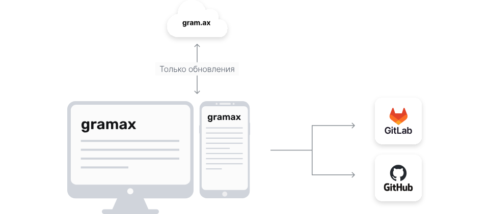

Создавайте качественную и красивую документацию с помощью Markdown и Git, обсуждайте детали с клиентами в комментариях WYSIWYG-редактора. Gramax бесплатный и опенсурсный навсегда.

### Почему выбирают Gramax?

Если вы хотите внедрить в компании Docs as Code и не запутаться в сравнении Markdown с AsciiDoc или Hugo с Gatsby, то для вас мы сделали Gramax.

Теперь вы можете создать и опубликовать публичную документацию за несколько шагов. Gramax убирает все сложности настройки и работы c Docs as Code инструментами, чтобы вы фокусировались на написании контента и делились им с бизнес-пользователями.

-  **Всё необходимое в коробке.** WYSIWYG-редактор, инлайн-комментарии, автоматически обновляемый докпортал, диаграммы, удобные ссылки, Git, поиск.

-  **Быстро работает.** Встроенный поиск, редактор, докпортал.

-  **Удобное ревью.** Можно смотреть, редактировать и комментировать статью в браузере.

---

## Посмотрим как это работает

---

### Запустите Gramax

Если вы регулярно работаете с текстом, то удобнее иметь отдельное приложение на компьютере. Если вы иногда проверяете и корректируете чужой текст, то удобнее в браузере.

-  Начать в браузере.

-  Скачать приложение.

*Под кнопкой “Начать в браузере”:* Хранение в кэше браузера.

*Под кнопкой “Скачать приложение”:* Хранение на файловой системе компьютера.

---

### Создайте каталог с документацией

Git-репозиторий можно создать сразу из интерфейса Gramax. Или загрузить уже существующий.

1. Создайте ваш первый каталог и статьи.

2. Подключите ваш облачный или локальный GitHub или GitLab и опубликуйте каталог.

*Видео как создаётся эта статья: пишем заголовок, текст, используем хоткеи из панели, оставляем комментарий, подключаем хранилище, копируем ссылку в браузере и отправляем АМ в мессенджер.*

Теперь с вашим каталогом могут работать коллеги, достаточно отправить им ссылку из браузера. Техническим специалистам статьи всегда доступны в разметке Markdown в VS Code и других IDE.

---

#### Ревью с заказчиком

Каталог можно открыть по ссылке и работать с ним как в Notion или [Google.Docs](http://Google.Docs). А также можно обсуждать части текста в цепочке комментариев.

1. Cкопируйте ссылку в браузере.

2. Отправьте ссылку заказчику.

*Видео, как АМ открывает ссылку на статью и оставляет комментарий в цепочке.*

---

### Опубликуйте докпортал

Докпортал Gramax -- это набор быстрых HTML-страниц со встроенным поиском, которые обновляются автоматически.

1. **Разверните docker-образ Gramax.** Это делается [3 командами](https://gram.ax/resources/docs/quick-start) на собственном сервере или в публичном облаке.

2. **Подключите Git-хранилище.** Авторизуйтесь в вашем GitHub или GitLab и загрузите созданные каталоги на докпортал.

*Видео как подключается каталог на докпортале.*

[Посмотреть докпортал -->](https://gram.ax/resources/docs)

---

## **Конфиденциальность**

Gramax работает напрямую с выбранным Git-хранилищем. Взаимодействие с нашим сервером происходит только для получения информации о новых версиях.

---

Вы можете помочь сделать работу в Docs as Code удобной, как никогда раньше. Вступайте в [сообщество Gramax в телеграм](https://t.me/gramax_chat), чтобы узнавать новости о Docs as Code и проекте.

[Twitter ](https://twitter.com/gram_ax)[Telegram ](https://t.me/gramax_chat)[GitHub](https://github.com/Gram-ax/gramax)