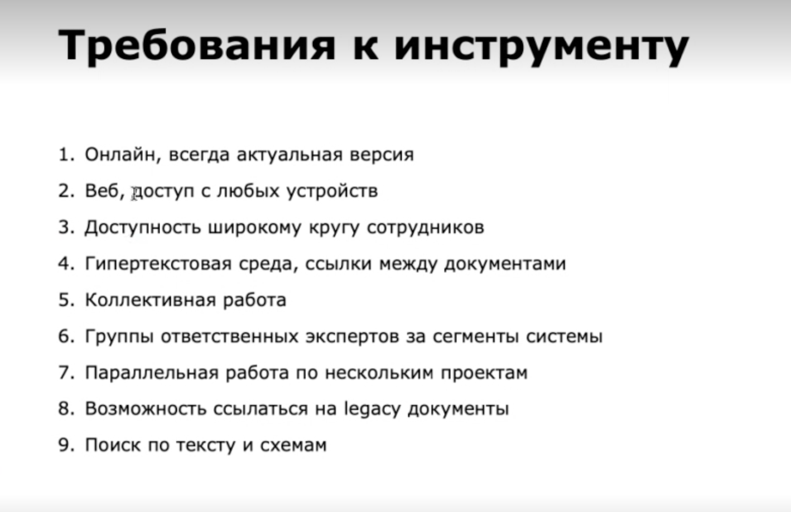
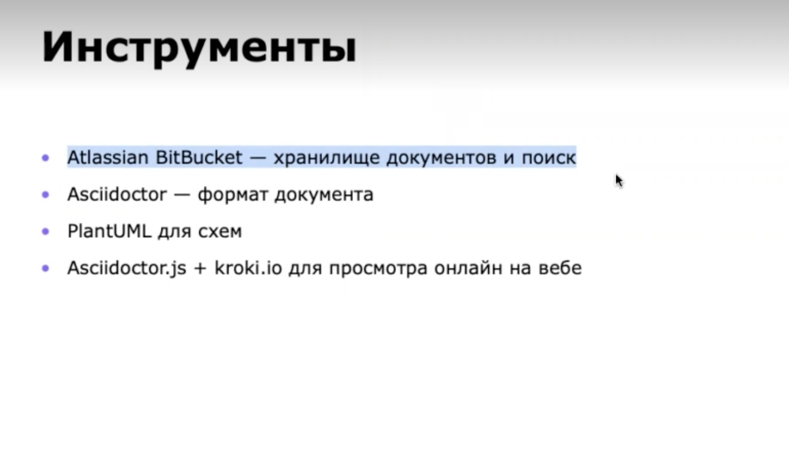

Архитектор в Юmoney. [Запись созвона с презентацией решения](https://icsitru-my.sharepoint.com/:v:/g/personal/ekaterina_pavlova_ics-it_ru/ESdCVZRQkOVNkDz9fhryA50Bxj1-FEFveXVBaoHrMppslQ?e=eKwrpb). Нашла еще его выступление на ютубе — [https://www.youtube.com/watch?v=EgBtmGcTgr4&ab_channel=ЮMoneyTech](https://www.youtube.com/watch?v=EgBtmGcTgr4&ab_channel=%D0%AEMoneyTech).

Откликнулся на мое сообщение, вступил в диалог с другим участником чата. Про выбранную систему рассказал так:

*Эта история окаазалась больше не про инструменты, а про методику декомпозиции контекстов системы, границы и жизненный цикл документов.*

*Инструменты — Atlassian BitBucket, Atlassian Jira, Asciidoctor, PlantUML, но это вам мало о чем полезном скажет*

*Я  еще раз процитирую EABoK*

*Who is an Enterprise Architect?*

*EA practitioners capture and structure organizational knowledge. They analyze, connect, and integrate relevant information from different sources (both internal and external) to make it useful for decision-making. The Enterprise Architect is an experienced, multi-disciplinary, technology-savvy expert tasked with developing an understanding of all facets of the organization’s structure, data (both structured and unstructured) and information streams.*

Компания работает 10 лет, у них есть 300 разных сервисов и 10 продуктов. Работают по проектам - на проект формируется команда, после проекта она расформировывается.

Сначала писали в вордовских файлах, потом в конфлюенсе. Конфлюенс не устроил по нескольким причинам:

- Плохой поиск.
- Не был продуман подход и дока была по командам и проектам.
- Не подходила древовидная структура.

Потому было важно начать вести доку по “стабильным сущностям”. Основа категоризации:

- Платформа — набор переиспользуемых вервисов.
- Продукт — комплекс сервисов.
- Сервис — сущность, выполняющая определенный сценарий.

В итоге сформировались следующие требования:

И вот как они это решили:

Потом время звонка закончилось, а новый я на запись не поставила((

**Гипотеза согласования решения по воркфлоу**

Роману идея понравилась, но у него есть небольшие сомнения: у многих заказчиков процесс идет через вордовские документы и они не согласятся это делать в другом инструменте. 
Хотя для внутренних согласований такое решение подойдет.

**Гипотеза визивига**

Роман сомневался, все ли примут его решение (вдруг кто-то будет протестовать против гита и языка разметки). Но никто не сопротивлялся. Новичкам хватает 2-3 дней, чтобы разобраться. Ну и в компанию не нанимают людей, боящихся гита и инструментов разработки.

Также его радует, что у них сборная солянка из инструментов. Это позволяет писать через любую прогу.

**Гипотеза ревью через воркфлоу**

У них в компании ревью проводят сторонние команды. Все это происходит по регламенту, где каждый член проверяющей команды должен поставить свой апрув. Замечания оставляют в виде комментариев.

Такой процесс им удобен и проблем не видят.
