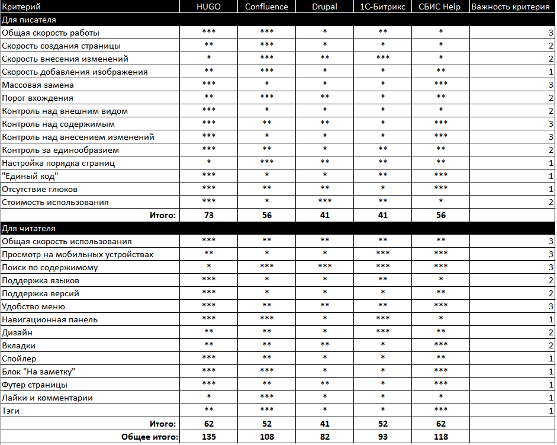

Руководитель отдела документации. Компания — Сетевые решения([https://www.lanbilling.ru/](https://www.lanbilling.ru/)), разрабатывают биллинговую систему. Ссылка на доку — [https://docs.lanbilling.ru/39/](https://docs.lanbilling.ru/39/), ссылка на [запись разговора](https://icsitru-my.sharepoint.com/:v:/g/personal/ekaterina_pavlova_ics-it_ru/EfgHsWhuhstDsgBRffnyIcUB0-A9UQHc6o97JGy_3kGhWQ?e=jJt7qd). 

**Ключевая проблема в компании (зачем наняли Сергея):** в компании уже была документация, ее писали сами сотрудники. Оформляли в один PDF на 600 страниц. Без структуры, без очевидной пользы и со сложной навигацией. 

Всю доку нужно было сделать полезной и читаемой. Руководство уже осознавало, что в файле вести доку — жесть и были готовы менять систему.

Так как внутренняя дока уже велась в HUGO, Сергей разобрался в нем и сравнил с другими системами. 

В нашем диалоге сложилось впечатление, что HUGO он выбрал, так как ему было любопытно разобраться и настроить все самому. При этом прозвучала фраза, что руководство было готово потратить деньги на систему для доки, если бы Сергей такую попросил.

**Табличка со сравнением от Сергея:**

**Почему Сергею не нравится конфлюенс:**

Я выделил основные причины, по которым не нужно переходить на Confluence (в порядке важности)

1. Документация должна храниться в системе контроля версий: это упорядочивает работу и сохраняет чёткую структуру

2. Писатели не должны публиковать изменения без ревью руководителя, иначе будет бардак

3. Confluence не даёт полного управления над дизайном сервиса, оформлением статей, добавлением фич и так далее

4. В Confluence невозможно провести массовую замену, например исправить ссылки или переименовать термины

5. Правильнее верстать статьи на языке разметки (html, markdown), чем в визуальном редакторе

6. Confluence более тяжёлый, поэтому работает медленнее

7. Confluence и отдельные макросы (вкладки, поддержка разных языков и так далее) требуют немалой ежемесячной платы

8. Чтобы разобраться в деталях работы с Confluence и перенести туда документацию, понадобится несколько месяцев

**Развернул и поддерживает HUGO сам.** Считает, что потратил на это не очень много времени.

**Проблемы в HUGO:**

- Сергей поддерживает сам и ему не хватает опыта для доработок
- Некоторые визуальные элементы не дружат друг с другом

При этом эти проблемы он считает не настолько существенными, чтобы переходить на другую систему. Понравился докридер, но он уверен, что перенести и переучиться будет дольше и дороже, нежели мириться со своими мелкими проблемами.

**Предпросмотр:** на локальном стенде, запускается быстро, никаких проблем.

**Ревью:** Сергей делает скрины в статьях писателей и отмечает в пеинте ошибки и проблемы. Не любит этот процесс, предпочитает лично показать ошибки человеку. 

**Проверка ссылок:** linkslug — сторонний сервис.