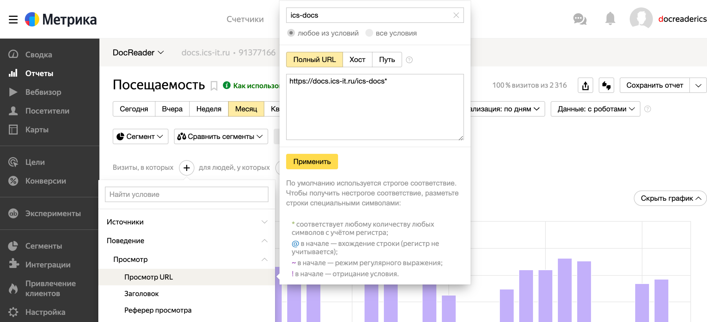
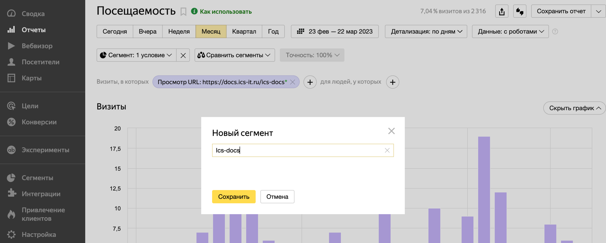

К каталогам нашей компании подключен сервис Яндекс.Метрика. В нем можно просматривать статистику посещения каталогов и отдельных разделов.

Пароль для входа в аккаунт лежит в сервисе Passwork.

## Детализировать отчет до каталога

По умолчанию метрики строятся для всех каталогов на портале. Чтобы детализировать каждый отчет до каталога, нужно создать сегмент.

1. Откройте любой отчет. Например, *Посещаемость*.

2. Кликните *\+*, затем *Поведение/Просмотр/Просмотр URL*.

3. Введите URL каталога и поставьте *\** после последнего символа.

4. Примените настройки.

   

5. Сохраните сегмент, чтобы использовать его в других отчетах -- нажмите *Сегмент/Сохранить как* и заполните поля.

   
