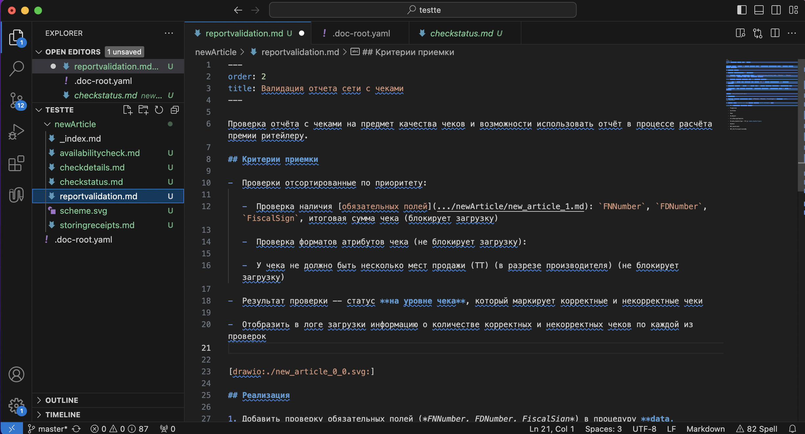

Привет! Меня зовут Катя, я CPO Gramax. В статье хочу обсудить подход Docs as Code, который все чаще упоминается в разных блогах и на конференциях.

В продуктовой и проектной разработке всегда остро стоит вопрос накопления и актуальности информации. От внутренних знаний команд -- до пользовательской документации. И это вопрос не только внутренних бизнес-процессов, но и инструментов.

Хранить информацию можно в облачных вики, ворд-файлах, задачах в таск-трекере. Также для этой задачи можно использовать инструменты разработки. Но подробнее опишу ниже.

В этой статье разберем:

-  Что такое Docs as Code.

-  Какая польза и вред от использования подхода.

-  В каких ситуациях на него уместно переходить, а в каких -- нет.

## Вводные данные

По версии [comment:17]самого популярного[/comment] [ресурса про документирование API](https://starkovden.github.io/index.html), Docs as Code это:

> [comment:18]docs-as-code[/comment] означает использование тех же систем, рабочих процессов и подходов к работе документами, что и с программным кодом.

[comment:19]Что это означает на практике -- аналитики, технические писатели, менеджеры и все-все, кто связан с кодом, пишут доку там, где и код. Никаких сторонних систем по типу вики не используют.[/comment]

## Стандартный набор инструментов

Чтобы Docs as Code взлетел, необходимо настроить процесс подготовки и сборки документации. Обычно для этого требуется.

### Система контроля версий

Варианты -- GitHub, GitLab, BitBucket.

Система контроля версий нужна для того, чтобы можно было версионировать документацию и работать совместно над текстом с помощью Git.. [comment:8]В Git используют ветки (дубликаты основной версии) и команды для промежуточного сохранения результатов (коммит и пуш).[/comment]

Например, у вас есть основная релизная ветка Master. Чтобы не засорять ее при подготовке документа по задаче, вы создаете ветку Issue-5. В ней без ограничений пишете: создаете черновик, вносите исправления, согласовываете с ответственными.

Когда документ готов, объединяете (мержите) ветку Issue-5 с основной Master. До момента объединения документ в Issue-5 доступен только вам -- не нужно волноваться об опечатках, некрасивой структуре и слежке коллег. Также это помогает не пускать в продакшн сырые или кривые тексты.

### [comment:22]Язык разметки[/comment]

Варианты -- Markdown, [comment:20]HTML[/comment], LaTeX, reStructuredText, AsciiDoc.

Любой текст на сайте или в приложении состоит [comment:21]из двух частей[/comment]:

-  Сам текст (контент) -- это просто набор букв и символов.

-  Разметка -- распределяет текст на удобные и красивые смысловые блоки.

По сути разметка говорит: “вот это предложение должно лежать здесь и выглядеть вот так”.

Чтобы задать разметку, нужно оформить каждое слово и предложение с помощью специальных символов. Например, разметка в самом легком языке Markdown выглядит вот так:

### Текстовый редактор

Варианты -- Visual Studio Code, Notepad++, Atom.

В текстовом редакторе вы как раз создаете файлики, в которых пишете текст, используя язык разметки.

### Генератор статического сайта

Варианты --  [comment:4]Hugo, Jekyll, Gridsome[/comment]. Также можно использовать специальное опенсурсное ПО для генерации документации -- Docosaurus, AsciiDoctor, Pandoc.

Генератор статического сайта (SSG) создает из ваших файликов с текстом красивый сайт со страничками. Это то, что увидит читатель.

### Хостинг

[comment:23]Чтобы вашу документацию смогли увидеть читатели по ссылке в браузере, необходимо разместить её на сервере в виде статического сайта.[/comment]

### Инструмент сборки

Вам понадобится механизм доставки текста в языке разметки до хостинга в виде HTML файлов. Для этого используют CI/CD -- это конвейер, который смотрит в ваши файлы, преобразует их, а затем выкладывает их на хостинг в виде статического сайта.

[comment:9]В случае со специальным ПО для документации, CI/CD как раз встроен в него[/comment] -- например, в Diplodoc от Яндекса. Но если используется обычный SSG, этот конвейер нужно настроить вручную.

### Дополнительные плагины

Это опциональная часть, которая просто ускоряет и автоматизирует работу автора. Плагины устанавливаются в текстовый редактор. Для чего могут пригодиться:

-  **Для предпросмотра оформления**. Когда смотришь на текст в разметке, не всегда понятно, как он будет выглядеть на сайте. Плагин превью может сразу показать, как оформится текст. [comment:24]Но только в том случае, если используются стандартные элементы оформления.[/comment]

-  **Для визуальной подготовки таблиц**. Рисовать таблицу в языке разметки -- сложно. [comment:25]Гораздо удобнее сначала сделать ее в визуальном редакторе, затем перевести в код.[/comment]

-  **Для проверки на ошибки**. Например, перекрестные ссылки на сайте принято задавать относительными ссылками. В них можно ошибиться, потому плагин разумно использовать для проверки всего каталога.

-  **Для автоматического форматирования**. У каждого SSG есть свои требования к языку разметки -- какие должны быть отступы, где нужны пустые строчки и так далее.[comment:26] Плагин может автоматически[/comment] отформатировать весь текст в файле, чтобы это не пришлось делать вручную.

## [comment:12]Польза[/comment]

Сейчас, когда вы испугались огромного списка, стоит рассказать, ЗАЧЕМ ЭТО ВСЕ и какую пользу получите.

### Красивый и быстрый сайт для читателей

Конечно, можно сделать большой документ в ворде. Или загрузить доку в вики-движок, который будет загружаться по несколько минут. Но зачем, если есть возможность создать быстрый и красивый статический сайт? [comment:27]А еще задать на нем свои стили, добавить кнопки контакта и многое другое.[/comment] Хороший сайт не стыдно отправить серьезному заказчику. Или предложить клиентам его читать.

Особенно это важно, если работаете в B2C сегменте с высокой конкуренцией. Наличие хорошего и подробного справочного сайта -- еще один аргумент в вашу пользу.

### Единый источник правды

Если вы давно и плотно в разработке, то хоть раз сталкивались с проблемой поиска, неактуальности, рассредоточености информации. Например, когда аналитик пишет ТЗ и проектные доки в ворде, разработчик -- в таск-трекере или коде, а технический писатель в вики. [comment:28]Собрать целостную картинку о функционале или потребности практически невозможно.[/comment]

Используя подход, вы всех участников разработки загоняете в одно хранилище. Он содержит и программный код, и документацию.

### Актуальность

Так как все сотрудники пишут документацию в одном месте, больше шансов найти устаревшую информацию. И актуализировать ее.

### Версионность

Если процесс разработки отлажен и в команде любые доработки связаны с версией -- документацию также легко к ней привязывать. [comment:29]Например, ветка Version 1 содержит код первой версии и документацию конкретно к этому состоянию системы. В ветке Version 2 уже пишется код для следующей версии.[/comment] А также дополняется и редактируется документация под новое состояние.

Если, например, все клиенты работают в разных версиях -- не нужно под каждого делать отдельную документацию. Или добавлять в статьях пометки типа “доступно от версии 3”. [comment:30]Просто настраиваете в каталоге переключение и клиенты сами находят инструкции по своей версии.[/comment]

### Сохранение подробной истории

Это полезно, когда нужно восстановить ход событий: почему приняли какое-то решение, кто его принял, кто участвовал. [comment:31]Система контроля версий сохраняет все редакции файла[/comment]. С детализацией до времени и пользователя.

[comment:32]Если представить идеальный процесс, через систему контроля версий должна проходить абсолютно вся информация: от первого контакта с клиентом, до пользовательской документации. Но это подробнее раскроем в следующей статье про "User story as Code”.[/comment]

## Вред

[comment:33]Не совсем правильно называть этот блок вредом, скорее “Проблемами” или “Вызовом”.[/comment]

### Сложное внедрение

В блоке “Стандартный набор инструментов” вы уже могли сделать вывод, что такой набор сложно подружить и долго настраивать. Это так -- для грамотной технической настройки нужен DevOps. Для грамотной настройки процесса в команде -- замотивированный и заинтересованный лид.

### Высокий порог входа

Технические писатели, аналитики и менеджеры должны будут знать (или изучить): как работает Git, как писать в языке разметки, как отправлять документацию на сборку. Проблема решается двумя способами:

1. **Продолжительное и мучительное обучение**. [comment:14]Оно также может столкнуться с сопротивлением, когда команда заявляет, что у нее и без новых практик все нормально работает.[/comment]

2. **Поиск и собеседование сотрудников с техническим бэкграундом**. Это значительно увеличивает срок поиска, ведь технарей мало и стоят они очень дорого.

### Бесконечная поддержка

Да, вам понадобится [comment:34]DevOps или DocOps[/comment]. Он будет поддерживать систему, разбираться с ошибками, обучать новых пользователей. Это, понятное дело, тратит бюджет команды.

## [comment:16]Когда уместно переходить[/comment]

Тут мы выписали основные проблемы, с которыми сталкивается команда. Для каждой проблемы обозначили: когда не нужно переходить на DaC, а в каких ситуациях без него не обойтись.

### Слабая практика накопления информации

**Стоит переходить:**

-  Когда разработчиков больше, чем нетехнических специалистов. И удобство/наличие информации от разработчиков немножко важнее.

-  Если пытались договориться о новом процессе, но не получилось. Например: наказали разработчикам писать все в конфлюенс. А оказалось, что самое актуальное и важное они пишут где-то у себя. И переносят в конфлюенс только после просьбы.

**Не стоит переходить:**

-  Если разработчиков мало и легче их заставить писать в системе, где пишут нетехнические специалисты.

-  Если только-только встаете на рельсы “информация -- это важно”. Сначала учимся тереть морковку на терке (строить процессы), а потом задумываемся о кухонном комбайне (улучшенных инструментах).

### Информация всегда устаревшая

**Стоит переходить:**

-  Если пытались договориться о том, что информацию регулярно кто-то обновляет. Но договоренности быстро забывались.

**Не стоит переходить:**

-  Если еще не пробовали разговаривать с командой о важности актуальной информации. Возможно, будет достаточно просто договориться о том, что, кто и когда обновляет.

### Пользователи ничего не понимают и терроризируют поддержку

**Стоит переходить:**

-  Если инструкций много и важен быстрый поиск по ним.

-  Если на рынке много альтернативных решений и клиенты принимают решение в том числе, оценивая портал документации.

**Не стоит переходить:**

-  Если всего 3 инструкции для пользователя и они короткие.

-  Если вы подрядчик (заказная разработка). И наличие документации -- просто пункт в договоре.

## Вывод

Вывод прост -- Docs as Code -- это круто. Но подойдет не всем.

Если вы хотите его использовать, но боитесь проблем -- у нас есть [Gramax](https://gram.ax/enterprise). Он бесплатный и очень простой. Вступайте в [канал в телеграмме](https://t.me/gramax_chat), где мы обсуждаем само приложение и проблемы документации.

Давайте вместе делать удобно и просто!