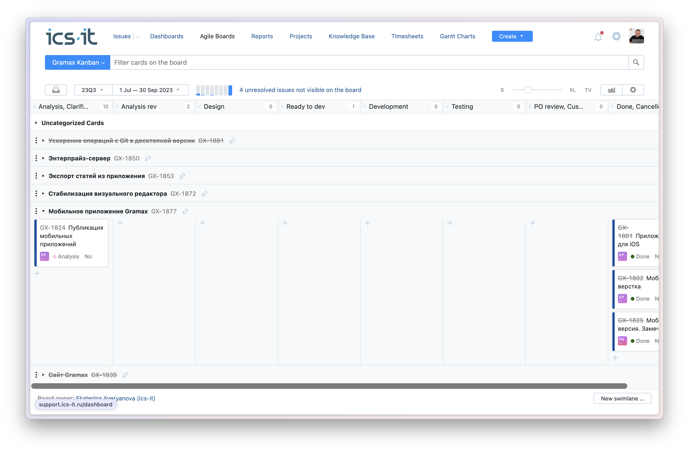
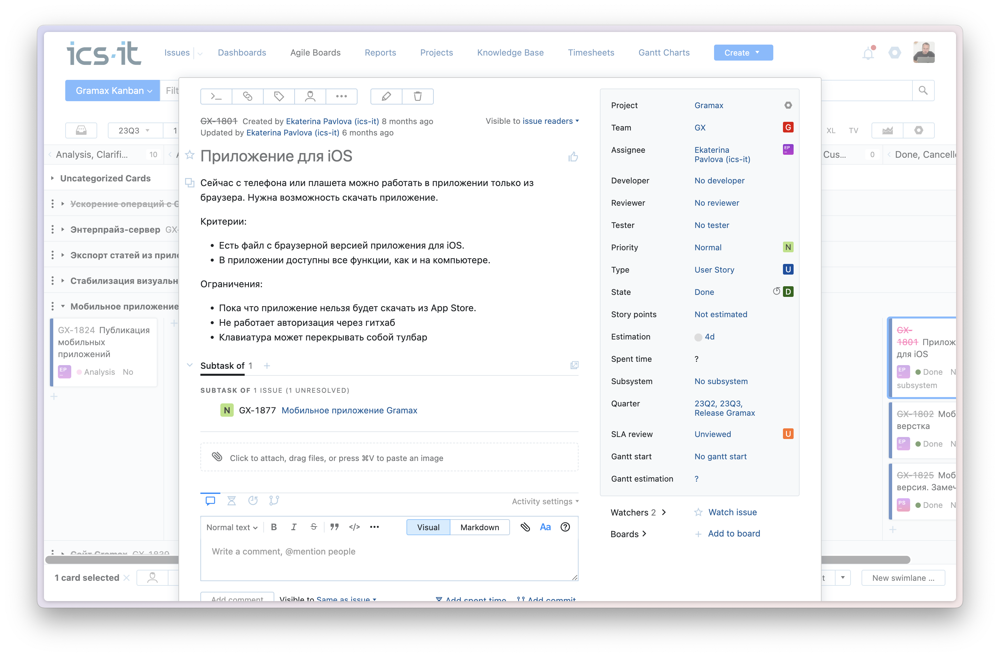
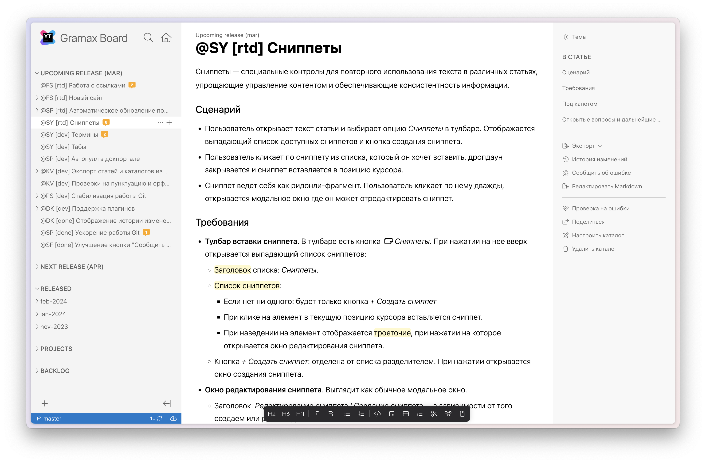

Уже 10 лет наша компания ведёт проекты и задачи в Youtrack, до этого работали в Jira и только сейчас пришли к тому, что для продуктовой разработки достаточно минимального количества простых инструментов. Поэтому перевели продуктовую разработку в текстовый редактор на базе markdown.

Почему решили так сделать? Youtrack и другие таск-трекеры перегружены функциями, но нет ключевой функции -- удобная работа с текстом. Ведь 80% разработки -- это анализ, обсуждения, проработка идеи. И только 20% -- это разработка по статусам, со списаниями и прочими вещами.

-  Что использовали таск-трекер и тамне всё удобно, как кажется.

-  Больше описать как у нас работало в начале.

-  

## Как работала разработка до изменений

Посмотрите на скриншоты нашей доски, вроде всё в порядке и по всем канонам, но чего-то не хватает…

В теле эпиков и юзерсторей делали классическое описание по скраму, обсуждали постановку в мессенджере, на звонках, в комментариях к заявке. Но что-то тут тоже есть противоестественное..

В какой-то момент мы поняли, что формат карточек и комментариев под ними громоздкий и не даёт удобно оперировать текстом постановки и видеть картину в целом. В карточках сложно ориентироваться и нельзя быстро что-то найти и исправить. Это убивает творчество. И из-за большого “трения” для изменения описания в задаче, оно часто теряет актуальность. Потому что зайти в таск-трекер, что-то поправить, проверить не противоречит ли это другим требованиям -- это целая история.

Чего не хватает? Лёгкости. Мы хотим:

-  Свободно оперировать текстом в рамках задачи и между задачами.

-  Минималистичного UI, сфокусированного на постановке.

-  Обсуждений в комментариях к тексту постановки со стейкхолдерами, а не под задачей.

Сколько не крутили-вертели YouTrack, наши пожелания никак не выполнялись.

По-мимо  проблем с инструментами, у нас были и проблемы в процессах.

-  **Epic** -- содержал верхнеуровневое описание, группровал юзер стори, редко появлялся, часто разваливался в середине из-за других сложных задач или из-за того, что что-то недоучли.

-  **User story** -- шаг реализации эпика, часто на старте и в конце было много технических user story, которые пользователь никак не мог принять или оценить. Поэтому часто у нас были весьма унылые релиз ноутсы, т.к. что-то делали, а снаружи это не видно и рассказать об этом не можем.

-  **Bug/Support** -- все ошибки и “не работает”, которые заводили юзеры. Отдельный человек у нас занимался багфиксами и саппортами.

Чего нам не хватало в процессе разработки? Осознанности вносимых изменений в код:

-  Понимания, что даже небольшое изменение в систему или багфикс стоит рассматривать с точки зрения общей концепции продукта.

-  Анализ ревью любого изменения под пристыльным вниманием и обсуждением.

Без этой осознанности и синхронизированности на уровне команды мы всегда возвращались к тому, что в середине реализации или на демо понимали, что “это” никуда не годится, мы не можем такое релизить и нам надо передлывать. Часто из “саппорта” появлялись несогласованные нововведения в системе, которые тоже никуда не годились и откатывались.

## Остановить переделки и легко делать постановки

Первое, что мы сделали -- это переосмысление существующих типов задач. С командой мы договорились о следующем понимании:

-  **Epic** -- целостная постановка задачи. Сейчас у нас любая задача это эпик. Одиноких юзер стори практически нет. Эпик содержит полное описание бизнес-требований, сценариев использования и технические детали реализации.

-  **User story** -- по-прежнему шаг реализации эпик, но с видимым и полезным инкрементом для пользователя. Чтобы мы могли быстро увидеть результат, заявить об этом в релиз ноутс. Если пошло “туго”, то уже на первых user story могли внести правки в эпик, а не после многодневных технических подготовок. Юзер стори должна делаться за 1-2 дня.

-  **Bug** -- то, что должно было работать, но не работает. Есть вещи, которые мы просто не учитывали на этапе проектирования -- это не баги, а это новые эпики. Оказалось, что реальных багов, которые можно сесть и сделать сейчас, у нас не так много. А много мест, где у нас не продумана до конца концепция использования, типизация компонентов и т.д.

-  **Support** -- сейчас это только вопросы пользователей в чате или в трекере заявок.

В американских компаниях от стартапов до Uber делаются Product Design Document и Technical Desugn Document. Делаются они, обычно, не в таск-трекере, а в Google Docs. В Google Docs легко работать с текстом,  оставлять комментари к фрагментам текста и совместно работать над задачей.

Посмотрев на эти практики мы поняли, что это и есть наш эпик и надо дать аналитикам и архитекторам  пространство для творчества, обсуждения, согласования. Которое будет лёгким, без лишних деталей и будет давать мысли свободно развернуться, а не погибнуть на десятом клике при открытии эпика.

Мы перевели архитекторов и аналитиков в нашу базу знаний с текстовым редактором и поддержкой markdown. Разработчиков оставили в YouTrack и давали им ссылку на описание эпика из тела задачи. Разработчики дальше сами разбивали эпик на юзер стори.

Стало удобно писать, не делаем заплатки, а прорабатываем концептуально задачи, которые решают проблему конечного юзера. Но не все проблемы мы  решили, плюс добавилась новые -- не удобно работать в 2 системах.

## Синхронизация и отказ от таск-трекера для разработки

Мы задумались, что нам даёт таск-трекер?

-  Уведомления на почту.

-  Разные атрибуты заявки.

-  Презентационный слой в виде доски.

Мы не согласуем задачи с внешними заказчиками, не списываем время. Большая часть команды разработки не пользуется почтой в принципе. Из значимых атрибутов у нас только статус заявки и ответственный.

Посмотрев на всё это мы решили, что можем перевести разработку тоже в базу знаний, не потеряв важных функций. Также у нас уже были ежедневные встречи по анализ ревью, которые заменяли почтовые уведомления. Это некий аналог скрам митингов, но только по задачам анализа и проектирования, т.к. на это  делается большой упор в нашей команде.

И мы перешли к ежемесячным релизам. Это означает, что в текущем месяце (Upcoming release) у нас находятся только те задачи, в которых всё кристально всем понятно. В текущем же месяце у нас идёт детальный анализ эпиков, которые будут сделаны в следующем месяце (Next release). Сейчас это выглядит как докпортал с узлами:

-  **Upcoming release** -- даёт всем понимание, что будет в ближайшем релизе.

-  **Next release** -- даёт всем понимание, что будет в следующем релизе.

-  **Released** -- задачи, которые были сделаны в прошлых релизах/месяцах.

-  **Projects** -- Долгоиграющие задачи, в которых списком перечислены ссылки на ключевые функции, которые требуются для завершения проекта. Это помогает не забывать о важных вещах, которые пообещали заказчикам или сами себе -- вижн развития продукта.

-  **Backlog**  -- представлен в виде статей с незаконченным описанием. Список идей, который хорошо бы не забыть сделать, но пока непонтяно как -- храним отдельной статьёй со списком этих идей.

Статьи/задачи перетаскиваем между узлами -- имитируя канбан доску. Статусы и ответственных прописываем текстом в названии статьи.

Эпики описываем полностью от пользовательского сценария использования end-to-end. Т.е. описываются все действия пользователя от начала до конца с детализацией пограничных кейсов, которые часто ставят в ступор всю команду в середине разработки, если их заранее не проработать.

Под эпиковыми статьями разработчики могут делать юзер стори, реализацию которых совместно смотрим каждую неделю. В конечном итоге весь upcoming release автоматически становится пунктами в relase note. Нет технических задач, о которых нельзя рассказать, остаётся лишь поправить формулировки и убрать излишнюю детализацию.

Саппорт и **реальные** баги оставили в таск-трекере, т.к. с ними  удобнее работать в YouTrack, чем в базе знаний.

## Какие преимущества получили

Меньше переделываем, благодаря детальной совместной проработке эпиков в течение месяца, фокусе на конечном результате для пользователя и общей синхронизации. Сейчас нет чисто технических задач с непонятным конечным результатом. Раньше могли что-то месяцами рефакторить без значимого результата.

Работаем в подходе Docs as code, а это означет, что исходники   хранятся в репозитории вместе кодом. Следовательно продуктовая команда читает и пишет статьи через визуальный редактор, а разработчики -- в  привычной IDE в markdown. Т.к. всё проходит через Git, любое изменение записывается в нашем GitLab. Всегда можно вернуться к старому состоянию статьи и узнать, кто внес изменения.

У нашей базы знаний есть декстопное приложение и это нечевидный, но очень большой плюс. Всегда открыто отдельное приложение с доской и можно в несколько кликов внести изменения или посмотреть чужие.

Есть и минусы, текстом прописываем ответственых и статусы, т.к. пока нет свойств статей, но с этим можно жить.