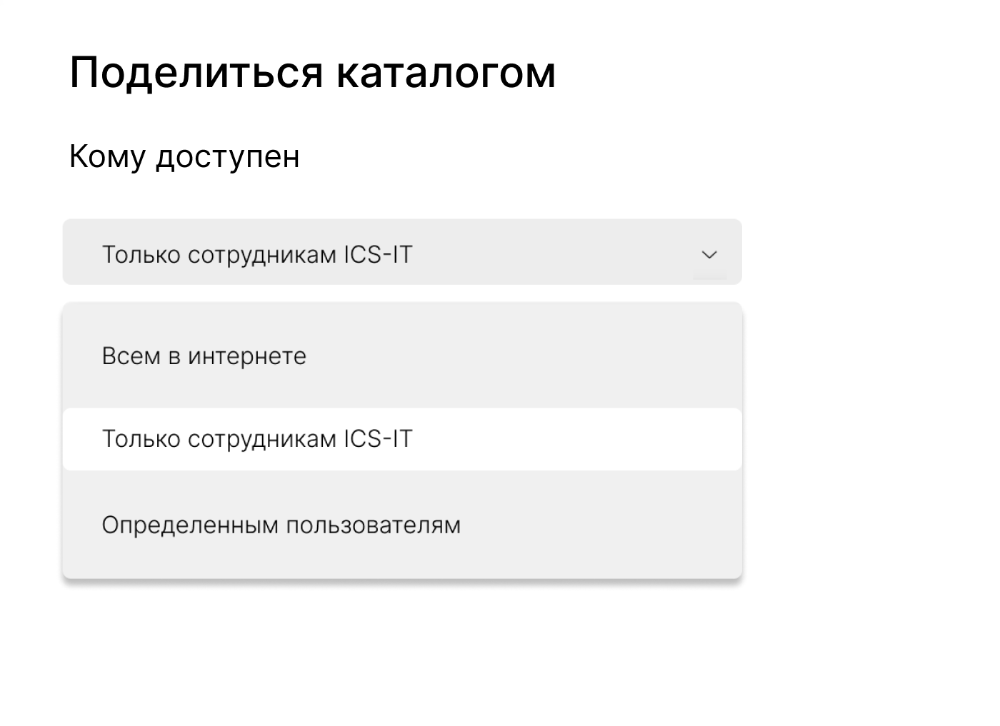
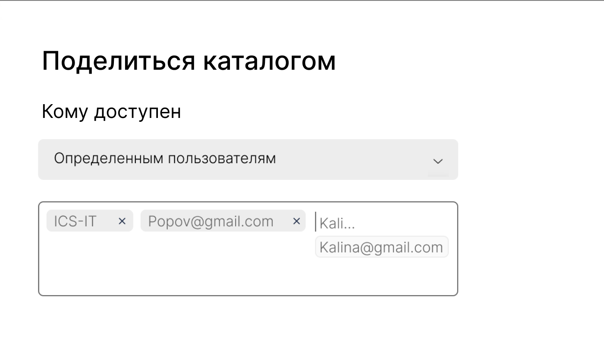
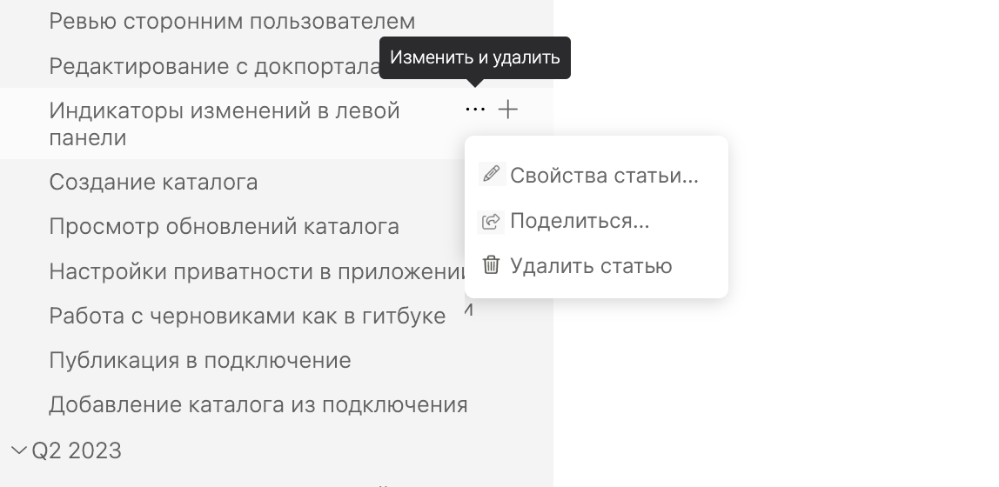
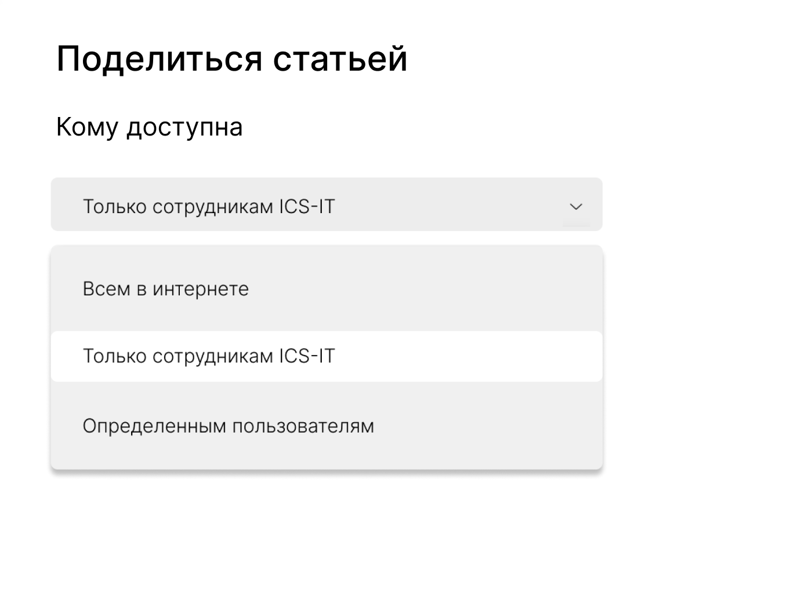
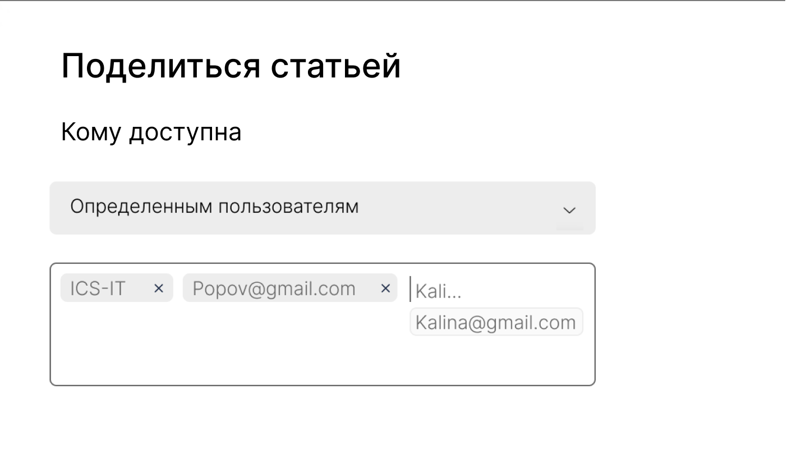

:::note 

[DR-1663](https://support.ics-it.ru/issue/DR-1663) Аутентификация и доступ по почте

:::

## Аутентификация на просмотр

++Как будет работать:++

1. Юзер нажимает Войти.

2. Появляется форма входа. В ней 2 варианта:

   -  По почте и паролю.

   -  Через Azure AD (доступно только для нашей компании).

3. Если юзер входит по почте и паролю, он вводит почту, затем придумывает пароль.

4. На указанную почту отправляется письмо для подтверждения.

Посмотреть реализацию тут -- <https://www.mann-ivanov-ferber.ru/login/>

## Поделиться всем каталогом

Как будет работать:

1. Юзер в правой панели нажимает *Поделиться каталогом* и появляется модальное окно с возможностями:

   -  *Каталог доступен*.

      -  *Всем в интернете*.

      -  *Сотрудникам ics-it* (привязано к Active Azure -- если DR развернут не в нашей компании, такого пункта нет).

      -  *Определенным пользователям*.

         

   -  Если выбрать *Определенным пользователям*, появляется инпут *Кому*. В нем автоматически указана группа ICS-IT из Active Azure (привязано к Active Azure -- если DR развернут не в нашей компании, такого пункта нет). Но эту группу можно удалить.

      В поле нужно вводить почты. Если пользователь с почтой уже зареган в DR, при введении адреса появляется подсказка с этим адресом.

      

## Поделиться разделом или статьей

Как будет работать:

1. Юзер нажимает троеточие рядом с названием раздела или статьи. Появляется меню:

   

   -  Если раздел: *Свойства раздела, Поделиться и Удалить раздел*.

   -  Если это статья: *Свойства статьи, Поделиться и Удалить статью*.

   -  Тултип: *Изменить и поделиться*.

2. Выбирает пункт *Поделиться*. Появляется окно (описано для статьи. Для раздела меняется на слово раздел):

   

3. Если выбрать *Определенным пользователям*, появляется инпут *Кому*. В нем автоматически указана группа ICS-IT из Active Azure (привязано к Active Azure -- если DR развернут не в нашей компании, такого пункта нет). Но эту группу можно удалить.

   В поле нужно вводить почты. Если пользователь с почтой уже зареган в DR, при введении адреса появляется подсказка с этим адресом. тест

   