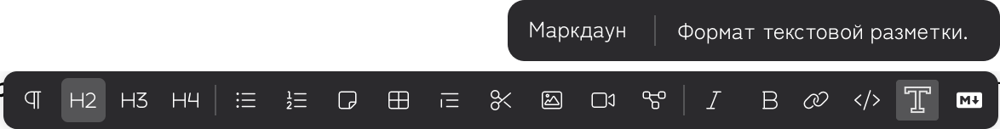
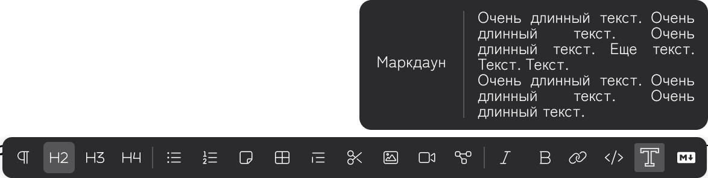

:::note 

[DR-1665](https://support.ics-it.ru/issue/DR-1665) Переиспользуемые термины в приложении

:::

Сейчас термины можно добавлять только через исходники, нужно реализовать возможность в приложении.

### Создание нового термина

#### **Оформление**

1. Иконка с буквой Т в панели редактирования (можно запросить иконку у Инны).

2. Иконка относится к инлайновым элементам, потому выводится как в нижней панели, так и в панели, когда выделяешь слово.

3. В дополнительной панели два поля: слева -- термин, справа -- пояснение.

4. Если пояснение длинное, поле растет вниз. Слово в левой секции выравнивается по центру.

   

#### **Процесс использования**

1. Пользователь выделяет слово и кликает иконку термина в панели.

2. Появляются дополнительные панели:

   -  Термин -- заполнено выделенным словом.

   -  Пояснение -- поле пустое, в него пользователь вводит термин.

3. Термин сохраняется в doc-root.yaml и может использоваться во всем каталоге.

### Использование существующего термина

#### **Оформление**

Как и при создании нового термина.

#### **Процесс использования**

1. Пользователь выделяет слово и кликает иконку термина в панели.

2. Если слово уже есть как термин, в дополнительной панели поля Термин и Пояснение уже заполнены.