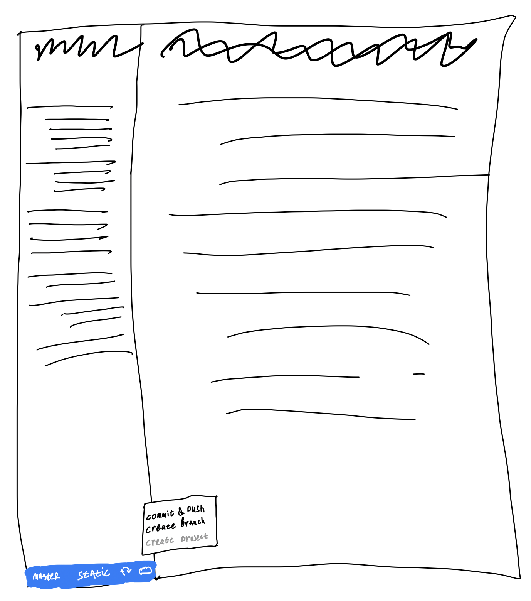
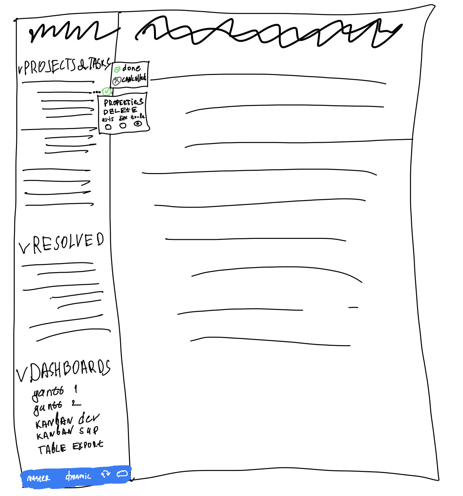

Документация -- это состояние системы на определённый момент времени. Задачи меняют состояние документации. Бренч -- это отражение задачи в гите. Необходимо дать возможность вести задачи в виде бренчей в Докридере.

При таком подходе мы сможем делать реальный docs-as/with-code, когда код будет лежать в одной ветке с постановкой задачи и документацией.

1. **Изменение состояния.** В мастер ветке  отредактировал статью и при коммите у меня есть опции:

   -  **Внести изменение** -- сделать коммит, который сразу попадёт в мастер.

   -  **Создать задачу** -- создать новый бренч и сделать коммит в бренч, а не в мастер. По умолчанию бренч называется как статья, но можно изменить название.

   -  **Создать проект** -- создать новые бренчи под каждый файл с изменённым контентом.\
      Доступно только если отредактировано много файлов, в остальных случаях горит серым с подсказкой в тултипе.

2. **Переключение режимов.** В  гит панели есть переключатель между режимами:

   -  **Static.** Можем  читать и вносить правки в статьи. Т.е. текущее состояние Докридера.

   -  **Dynamic/Project.** Видим все задачи (бренчи) по изменению  статей. Т.е. это режим управления проектом и задачами.

3. **Dynamic режим.**

   -  В левой панели видим группировку по открытым проектам и задачам. Задачи вне проектов находятся на том же уровне, что и проекты.\
      Внизу панели -- закрытые проекты и задачи.

   -  При клике на задачу видим последнюю версию текста из бренча. Через троеточие (или другой контрол) можем посмотреть исходную версию и дифф между ними.

   -  В навигации рядом с задачей есть кнопка [icon:check-circle] с выпадающим списком, которая резолвит задачу. После резолва она уходит в раздел закрытых вместе с  шапкой проекта.

### Допущения и ограничения

-  Предлагаю пока начать с простой двухуровневой структуры проект/задача (эпик/юзер стори).

-  Можем пока ограничить создание задач в dynamic режиме, задачи создаются только из static.

-  На одну статью можно завести несколько задач. Но одна задача не может отредактировать несколько статей, т.к. пока не понятно как это представить в dynamic.

-  Сейчас не продумана дальнейшая судьба ветки, после того, как её зарезолвили. Возможно стоит объединить это событие с мёржем в мастер.

-  Если статья многоуровневая, то при конвертации в проект вложенность теряем и все задачи на одном уровне.

### Предложения по реализации

-  Понадобится хранить где-то отдельно метаданные по веткам, т.к. для веток нам понадобится:

   -  Минимальные состояния задач: resolved, unresolved, cancelled. Гит позволяет только удалить ветку, но не позволяет её закрыть без удаления.

   -  Сортировка относительно друг друга.

   -  Связь parent-child между проектом и задачей.

   -  Связь между бренчом и изменяемой статьёй.

-  Все метаданные можно хранить в отдельной скрытой от UI Докридера ветке в гите. Возможно стоит хранить в отдельном внутреннем репозитории.

### На будущее

-  **Объединить задачи в проекте.** Если разбивка по задачам оказалась слишком детальной, то их можно объединить в одну, путём мёржа веток и стандартным резолвом конфликтов.

-  **Типизация и атрибуты.** В интерфейсе статьи или задачи должно быть минимум типизации. Изменение атрибутов должно происходить либо командами (как в YouTrack), либо через дашборды.

-  **Дашборды.** В навигации в dynamic режиме есть раздел с дашбордами, который позволяет строить списки, таблицы, канбан доски, гантт чарты. Дашборды можно версионировать по веткам, чтобы каждый мог создавать свои, не мешая остальным.