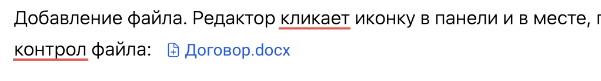
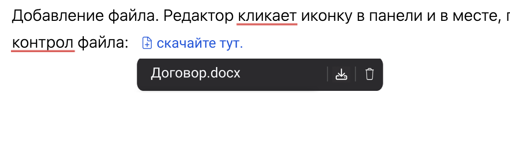

Я, как редактор каталога, хочу добавлять в статьи файлы разных форматов -- DOCX, PDF, PPTX и так далее. Также мне важно, чтобы читатель мог скачать эти файлы.

## [comment:2]Файл на компьютере[/comment]

[comment:4]**Добавление файла**[/comment]. Редактор кликает иконку в панели и в месте, где у него стоит фокус, открывается проводник, юзер выбирает нужный файл. Файл добавляется как ссылка.

**Редактирование файла**. Редактор кликает на ссылку с файлом и меняет текст. В дополнительной панели выводится название файла (оно не меняется, если менять текст ссылки), кнопка скачивания и кнопка удаления.

[comment:10]**Скачивание файла**[/comment]. Читатель на портале кликает на файл и он скачивается.

## Файл в облаке

Если файл лежит на облачном диске, работает как с обычными ссылками -- редактор выделяет слово, кликает значок ссылки, вставляет ссылку.