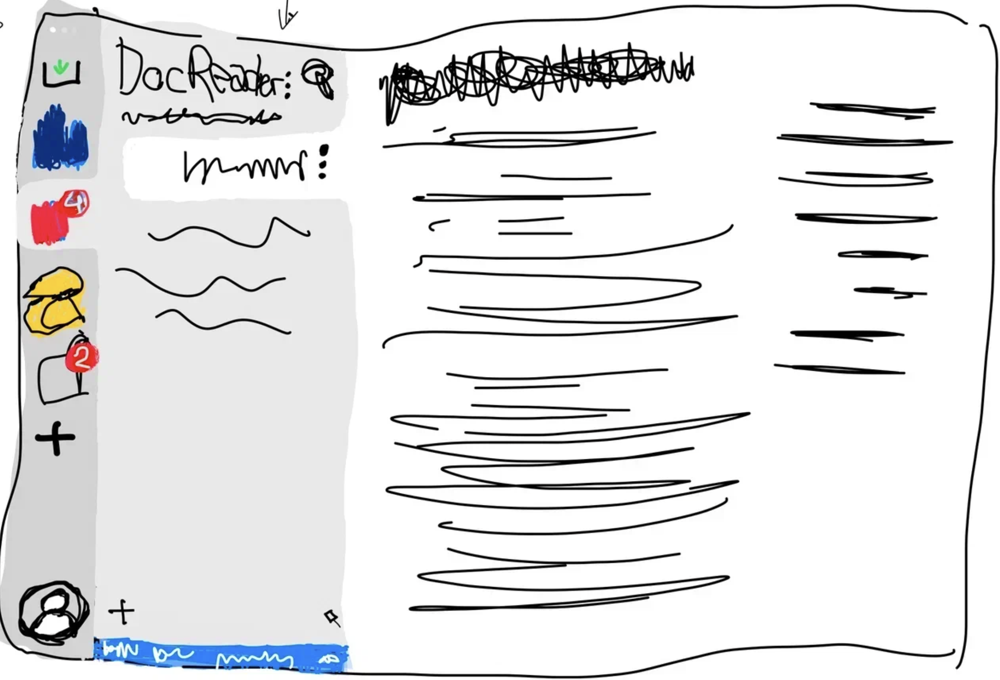

## Предлагаемый интерфейс

Внешний вид, к которому идем:

-  **Панель каталогов**. Слева добавляется вертикальная панель которая содержит сверху вниз:

   -  **Каталог INBOX** -- на картинке черный прямоугольник с зеленой стрелкой сверху. Быстрый клик для добавления каких-то заметок, которые потом нужно будет отсортировать. Этот каталог локальный и не поддерживает синхронизацию с облаком. По хоткею открывается этот каталог и открывается интерфейс добавления новой статьи. Предлагаю его делать над переключением workspace.

   -  **Воркспейсы** -- наверху точками переключение между рабочими областями. Это может быть второй очередью. Предполагается, что там будут пространства внутри организации, также воркспейсы для личной организации. Похоже на то, что есть в Arc (правда я не использовал ни разу)

   -  **Перечень каталогов** -- секция с цветные картинки или коды каталогов. На каталоге будут отображаться индикаторами с кол-вом изменений. При клике на каталог - осуществляется быстрый переход в этот каталог, так же как и при клике на статью в навигации.

      -  **Кнопка добавления нового каталога** -- серый плюсик в кружочке. Кнопка позволит загрузить существующий каталог или добавить новый.

   -  **Профиль**. Содержит информацию по текущему пользователю. Содержит все настройки приложения и пользователя, подключений и прочего в одном месте. При нажатии открывает подменю, при нажатии на элементы - открываются модальные окна.

-  **Панель навигации**. Остается почти без изменений, только сверху нет домика. Добавляется троеточие, по которому открываются настройки каталога. При сворачивании пропадает полностью, но появляется при наведении на панель каталогов. Которая в свернутом режиме становится полупрозрачной и не шибкозаметной.

-  **Правая панель**. Полностью избавляемся от нее:

   -  Верхнее меню с пунктами -- переносим в меню Профиля

   -  Содержимое страницы можно оставить как в paper, чтобы было на белом фоне крайне легкое отображение

   -  Действия над статьей -- переносим в меню статьи -- троеточие по статье (в навигации и в заголовке)

   -  Действия над каталогом -- переносим в меню каталога (троеточие рядом с названием каталога)

## Комментарии по Катиному предложению

-  Список каталогов -- в редакторе будет немного каталогов, с которыми человек работает, надо чтобы он удобно мог их у себя расположить. Возможно то меню домиком со списком каталогов, которое у тебя есть, можно перенести на кнопку плюсика для добавления каталога из общего перечня каталогов. В целом думается, что для энтерпрайза оставим пока текущую версию докпортала с главной страницей и списком каталогов.

-  Публикация -- предлагаю при нажатии снизу - синяя плашка раскрывается на всю высоту левой панели и там отображается список статей в максимально похожем на обычную навигацию виде, но только отфильтрованные по изменениям. Но это второй этап, пока предлагаю оставить пока все в модальных окнах.

-  Ветки -- нам нужна удобная визуальная карта веток по каталогу. Эти ветки будут отображаться деревом как в Fork, чтобы было понятно какая ветка из какой произошла. В этом же меню предлагаю сделать возможность кликнуть на другую ветку и на действие «Замержиться».

*Кстати, добавил подстатью и “Редизайн и МР” переместился. Еще добавил картинку и он не дал мне задать ей красивое имя. По сути у нас все что мы делаем называется new_article_XXX*