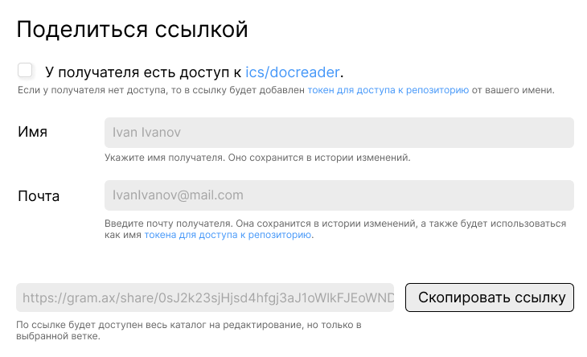
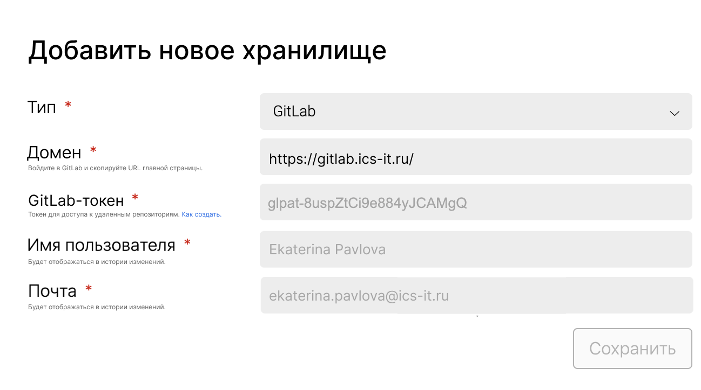
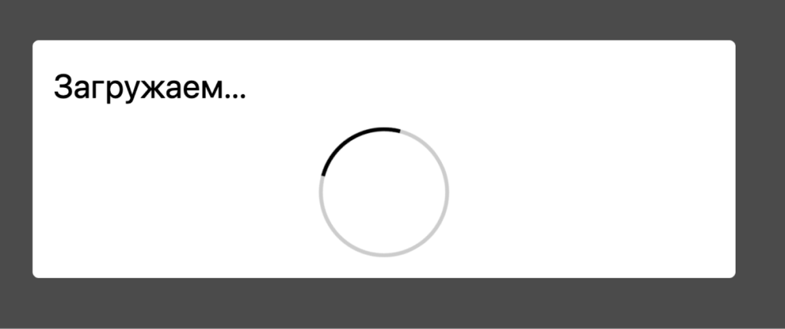

1. **Техпис публикует изменения и нажимает “Отправить на ревью”** в правой панели. Открывается форма.

   -  Чекбокс “Есть доступ”. В нем прописывается название репозитория.

      -  Если пункт отмечен, в ссылку добавляется токен. Появляются поля “Имя” и “Почта”.

         -  Данные из этих полей сохраняются в истории изменений.

         -  Данные из поля “Почта” используются как имя токена. Если на эту почту уже был создан токен, он удаляется и создается заново.

      -  Если нет -- токен не добавляется. Не появляются дополнительные поля.

   -  Текст-подсказка. В нем есть гиперссылка на страницу с токенами. В гитлаб или гитхаб, в зависимости от того, где каталог лежит.

   -  Поле со ссылкой. Ссылка содержит: тип системы, урл репа, ветка, закодированный токен (опционально).

   -  Кнопка “Копировать ссылку”. По клику ссылка копируется в буфер. Создается токен.

      

2. **Техпис отправляет ссылку проверяющему**.

3. **Проверяющий получает ссылку для ревью и переходит по ней.**

   -  Если есть доступ к репу -- открывается форма хранилища с предзаполненными полями. Ему остается ввести свой токен, имя и почта определятся по токену.

      [comment:alexander.machulin@ics-it.ru:2023-08-08T17|50|55.741Z]

      Минус грамакса и всех остальных систем, что я уже что-то писал насчёт токена, но уже не помню что и нигде это не сохранилось.\
      \
      Зачем вводить токен? Это неудобно. Почему нельзя логин и пароль ввести?

      [answer:andrey.lastochkin@ics-it.ru:2023-08-09T06|37|05.903Z]

      Да, лучше эккаунт подключить, разве что как расширенную возможность можно добавить возможность добавить токен

      [/answer]

      [/comment]

      

   -  Если нет доступа -- ничего заполнять не нужно, начинается клонирование.

4. **Клонируется каталог**. Когда данные указаны, автоматически клонируется каталог на нужной ветке. Ветку нельзя изменить, только синхронизировать.

5. 

   [comment:alexander.machulin@ics-it.ru:2023-08-08T17|53|09.607Z]

   Сейчас клонировал каталог, очень долго грузился и крутился этот кружок.\
   Хорошо бы какой-нибудь нормальный прогресс-бар иметь.

   [/comment]

6. **Проверяющий оставляет комментарии или редактирует**.

7. **Публикация.**

   -  **Проверяющий НЕ публикует свои изменения**. В нижней панели над кнопкой публикации отображается оранжевая точка.

   -  **Проверяющий публикует свои изменения**.

Альтернативный сценарий:

1. **Проверяющий переходит по ссылке**. При открытии каталога система проверяет, действует ли токен. Если он сгорел, появляется ошибка. Ошибка блокирует все действия в каталоге. Если ее закрыть, каталог закроется и выкинет на главную Gramax. Текст ошибки:

   [comment:alexander.machulin@ics-it.ru:2023-08-08T17|55|57.322Z]

   Наша система проверяет или гитлаб?

   [answer:andrey.lastochkin@ics-it.ru:2023-08-09T06|40|26.334Z]

   Это должно быть альтернативным сценарием, а не основным. Я так и не понял, чем закончился основной сценарий. Ревью закончилось ничем.

   [/answer]

   [/comment]

   -  Заголовок -- “Эта ссылка сгорела”.

   -  Текст -- “Для доступа к каталогу запросите новую ссылку.”