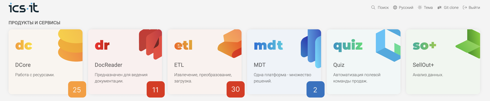
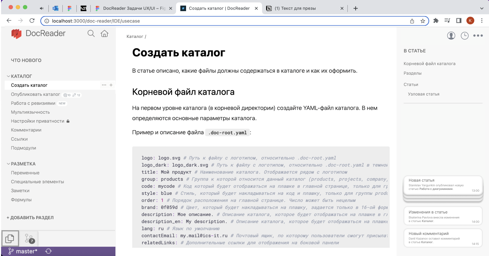

Я, как редактор или технический писатель, хочу в режиме реального времени отслеживать, что публикуют мои коллеги в открытый каталог.

### Отображение счетчиков во всех каталогах

-  Изменения в статье -- выводится счетчик с кол-вом измененных блоков.

-  Новые комментарии -- выводится счетчик с кол-вом новых комментариев.

-  Удаленные комментарии и цепочки пропадают из счетчика комментариев.

-  Новая статья -- выводится значок NEW.

-  На одной статье могут быть сразу все уведомления.

-  Уведомления выводятся для каждого отдельного залогиненного пользователя.

-  Когда пользователь открывает статью, счетчик изменений или значок NEW сразу пропадают. Если в каталоге выводятся значки и счетчики на каждой статье, пользователю нужно открыть каждую из них.

-  Значок с кол-вом комментариев пропадает, когда комментарии удалены.

### Счетчики на главной

-  На каждом каталоге выводится счетчик (одна цифра), в котором содержится общее кол-во комментариев и изменений.

-  Чтобы обнулить счетчик, нужно открыть каталог и прощелкать каждую статью, на которой есть уведомления.

### Пуш-уведомления в каталоге

-  Если у пользователя открыт каталог, в правой панели выводятся пуш-уведомления об изменениях.

-  Чтобы закрыть пуш-уведомление, нужно кликнуть крестик.

-  Если кликнуть по уведомлению, откроется статья, в которую внесли изменения или оставили комментарий.

-  Если пользователь выходит из каталога на главную или закрывает страницу, пуш-уведомления закрываются.

-  Пуш-уведомление содержит:

   -  Название статьи.

   -  Действие.

   -  Автора действия.

   -  Время действия.

-  Пуш-уведомления поднимаются снизу-вверх -- снизу самые актуальные, сверху -- устаревшие.

-  Если пуш-уведомлений больше 5, верхние 3 складываются в стопку. При клике на стопку уведомления растягиваются во всю высоту правой панели.

### Настройка уведомлений

-  Для каждого пользователя есть интерфейс настройки уведомлений.

-  В интерфейсе выводится список всех каталогов.

-  Для каждого каталога можно настроить отображение уведомлений:

   -  Новые статьи.

   -  Изменения в статьях.

   -  Новые комментарии.

-  В общих настройках можно выбрать, куда получать уведомления:

   -  На почту.

   -  Только в интерфейсе.

-  По умолчанию все уведомления во всех каталогах включены.