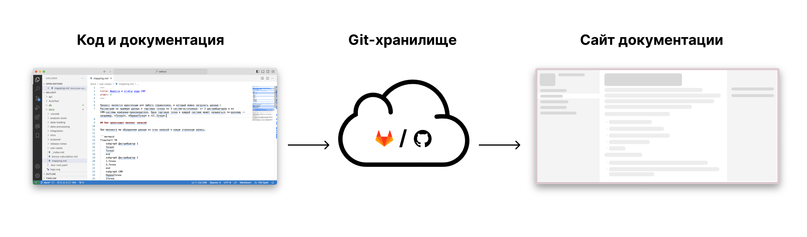
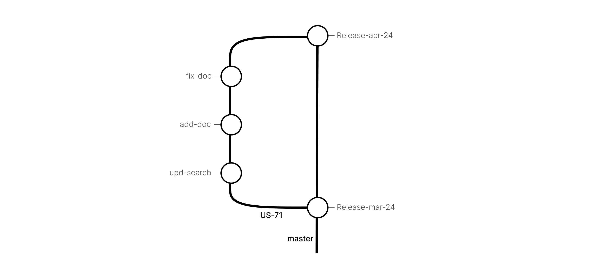
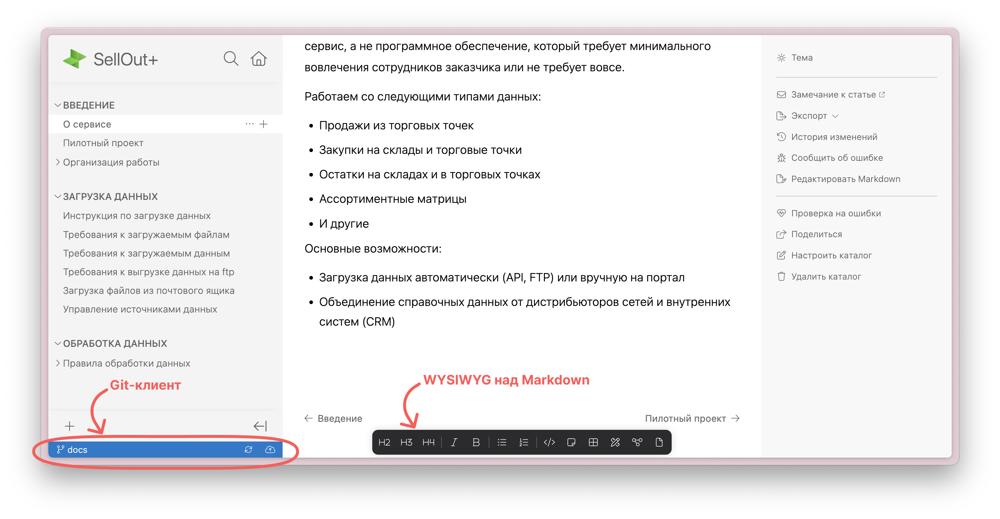
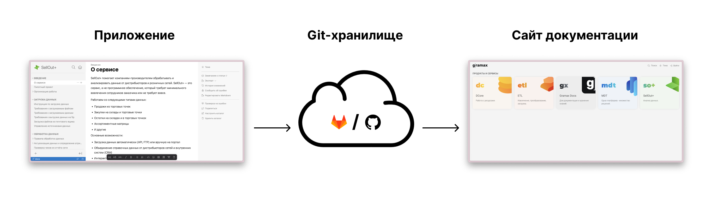
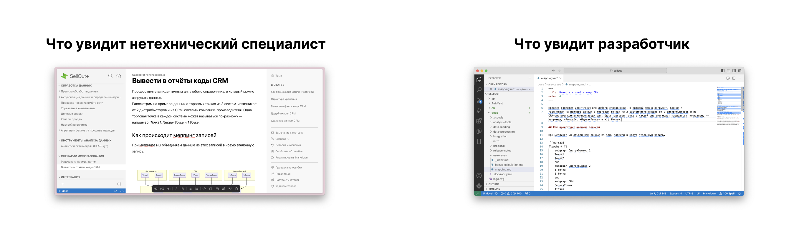
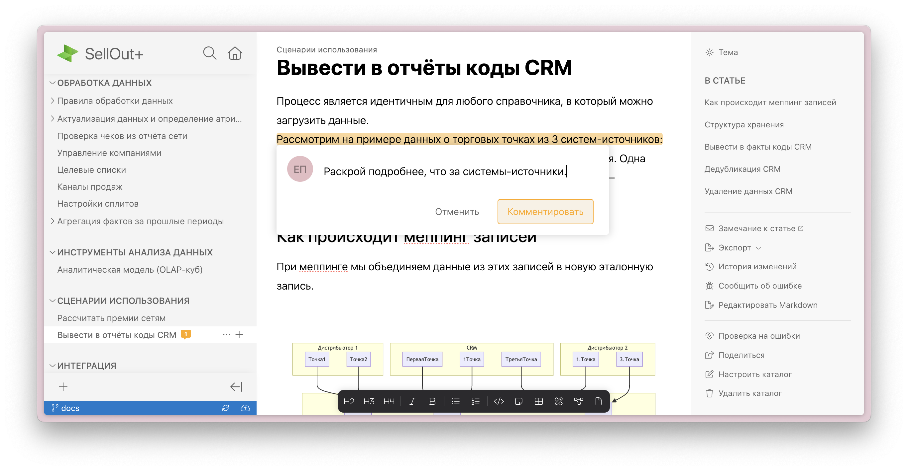
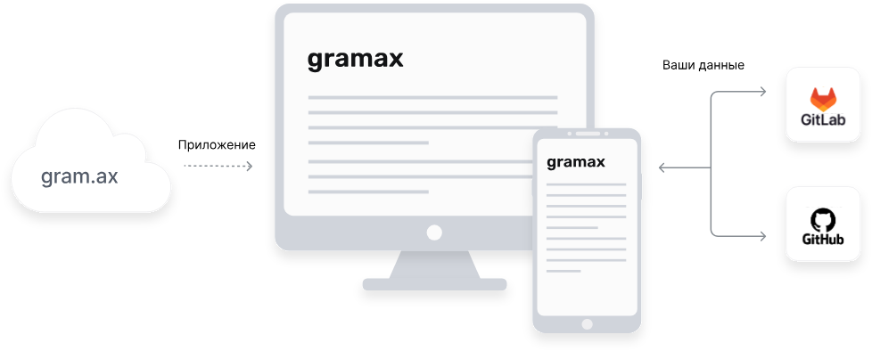

[cut:План:false]

1. Немного обо мне и команде

2. Почему документация важна для IT-компании

3. Почему важна актуальная документация

4. Почему не удается вовремя актуализировать

5. Документы как код: методология для актуальной документации

6. Преимущества и недостатки подхода

7. Документы как код в Gramax

8. Низкий порог входа = дешевый и быстрый процесс поставки

9. Непрерывная связь с разработкой

10. Только согласованная информация

11. Безопасность

12. Гибкость

13. Лицензии

14. Выигрыш от внедрения Gramax

[/cut]

## Немного обо мне и команде

-  Исследовали процессы создания документаии в 40 компаниях от Wi-Fi роутеров до IT-гигантов.

-  Изучили подходы к ведению документации в лучших open source проектах.

-  Выступаем на лучших конференциях для технических писателей.

## Почему документация важна для IT-компании

-  **Уменьшение нагрузки на поддержку.** Документация для клиентов снижает количество запросов в поддержку, что позволяет уменьшить штат сотрудников.

-  **Контакт с новым пользователем.** Большинство посетителей вашего сайта исследуют возможности продукта в документации, а не на самом сайте или в бесплатной версии.

-  **Минимизация bus-factor в команде.** Сколько членов команды должны “исчезнуть”, чтобы работа остановилась из-за недостатка нужных знаний?

## Почему важна актуальная документация

Если мы меняем систему, но не обновляем документацию:

-  **Теряем имидж в поддержке.** У команды поддержки нет ответов на вопросы пользователей или они не релевантны.

-  **Упускаем новых пользователей.** Посетитель сайта не найдёт необходимую для него возможность в документации.

-  **Поощеряем незаменимость специалистов.** На команде сильнее сказывается уход специалистов, с постоянным риском полной остановки работы.

## Сложно ли актуализировать документацию?

Да, наше исследование процессов в 40 компаниях выявило основную причину. После реализации доработки никому нет дела до написания документации из-за новых приоритетных доработок. Поэтому:

-  Информация о доработке разбросана по разным системам и сотрудникам.

-  Необходимо с трудом вытягивать информацию из разработчиков.

-  Проверяющие документацию уже недоступны и дают кусочную обратную связь в мессенджере, почте или устно.

## Документы как код: методология для актуальной документации

Docs as Code -- это методология, в которой процесс документирования интегрирован в процесс разработки. Его отличия:

-  Хранение документации в одном репозитории с кодом.

-  Версионирование документации вместе с кодом.

-  Публикация документации вместе с новой версией.

## Преимущества и недостатки подхода

Преимущества:

-  **Документация готовится в фича-бренчах.** Нет шанса что-то изменить в системе и не исправить документацию при публикации новой функции.

-  **Легко собрать сайт для читателя.** Все исходники документации хранятся в легковесной разметке.

Недостатки:

-  **Сложная настройка.** На внедрение подхода уйдет не один месяц и будет требоваться постоянная поддержка разработчиков.

-  **Высокий порог входа.** С документацией невозможно работать нетехническим специалистам.

## Документы как код в Gramax

Мы взяли подход Docs as Code и устранили его недостатки.

-  Развернуть портал документации можно[comment:1] за 1 час.[/comment]

-  Обучить сотрудников любого уровня -- за 1 день.

## Низкий порог входа = дешевый и быстрый процесс поставки

Аналитики, менеджеры, технические писатели даже не узнают, что пишут в Markdown, а публикуют все с помощью Git. Для этого мы сделали удобное приложение. [comment:2]Достаточно открыть его в браузере или скачать на компьютер.[/comment]

Создать и опубликовать новую статью можно моментально. Она сохранится в репозитории с кодом и отобразится на сайте для клиентов.

## Непрерывная связь с разработкой

Так как статья хранится в репозитории, разработчик может к ней обращаться из привычной IDE.

Изменения в Gramax синхронно транслируются в Markdown файлы на файловой системе.

## Только согласованная информация

В приложении есть встроенный механизм [comment:4]комментариев[/comment]. Отправляйте ссылку на статью коллегам и они смогут работать с ней сразу в браузере.

## Безопасность

Информация не проходит через наши и любые другие облачные серверы. Приложения напрямую интегрированы с вашим Git-хранилищем GitLab или GitHub.

## Гибкость

[comment:7]Gramax и портал[/comment] для читателей можно менять с помощью модулей, которые вы можете разрабатывать и поддерживать самостоятельно. Например:

-  Задать стиль и логотип для сайта и приложения.

-  Подключить модуль интеграции с таск-трекером.

## Open source и Enterprise

Gramax -- это open source проект, который будет всегда бесплатным и будет всегда обновляться новыми функциями.

Также есть self-hosted Enterprise версия, для более удобной работы на больших масштабах:

-  Вход через корпоративную SSO.

-  Удобное ограничение доступов.

-  Гарантийная поддержка.

-  Помощь с внедрением и обучение пользователей.

Лицензия Enterprise -- 54 000 ₽ за редактора навсегда и год получения обновлений.

Опциональное обновление версии -- 25% от стоимости лицензий.

## Выигрыш от внедрения Gramax

1. Сокращение штата технической поддержки.

   Всю информацию пользователи смогут найти сами на удобном портале с быстрым поиском.

2. Повышение лояльности со стороны пользователей.

   Когда пользователь вовремя получает актуальную информацию, его лояльность к компании повышается.

3. Увеличение продаж за счет информирования о новых возможностях.

   Новые пользователи сразу смогут получать информацию об улучшении системы. Следовательно скорее примут решение о покупке.

4. Сокращение срока онбординга новых сотрудников.

   Документация позволит им быстро изучить систему и сразу начать приносить компании пользу.