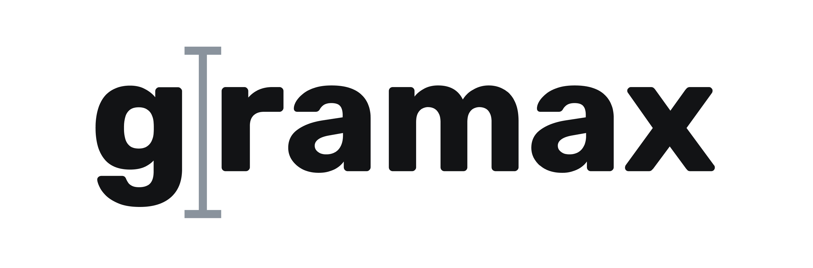

**Свяжите документацию с разработкой.**

Gramax -- это Docs as Code с удобным визуальным редактором и возможностью оставлять комментарии к фрагментам текста. И менеджеры, и аналитики, и разработчики теперь могут совместно работать над документацией.

-  **Хранение и версионирование вместе с кодом**. Файлы хранятся в легковесной разметке Markdown  в вашем GitLab или GitHub.

-  **Все необходимое в коробке**. Диаграммы Draw.io, Mermaid, PlantUML, спецификация OpenAPI, встроенные комментарии, поиск, экспорт в PDF и DOCX.

-  **Быстро работает.** Даже если информации очень много.