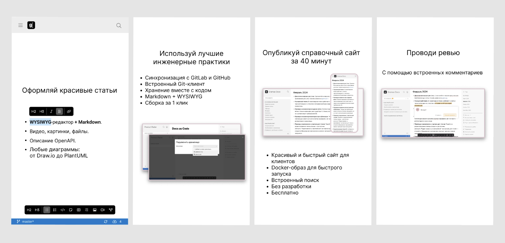

Нужно добавить картинки в стиле сториз.

## Макеты

Прикинула в фигме -- <https://www.figma.com/file/trdl4J5c97xO4ij3wp8Mu4/doc-reader?type=design&node-id=3581-209&mode=design&t=YRMQUlbpMb3Se7Kp-4>

## Тексты

1. Используй лучшие инженерные практики Docs as Code

   -  Синхронизация с GitLab и GitHub

   -  Встроенный Git-клиент

   -  Хранение вместе с кодом

   -  Markdown + WYSIWYG

   -  Сборка за 1 клик

2. Опубликуй справочный сайт за 40 минут

   -  Приложение с WYSIWYG-редактором

   -  Docker-образ для быстрого запуска

   -  Красивый и быстрый сайт для клиентов

   -  Без разработки

   -  Бесплатно

3. Оформляй красивые статьи

   -  Видео, картинки, файлы

   -  Любые диаграммы: от [Draw.io](http://Draw.io) до PlantUML

   -  Описание OpenAPI

   -  Понятный редактор

   -  Исходники в Markdown

4. Проводи ревью

   -  С помощью встроенных комментариев