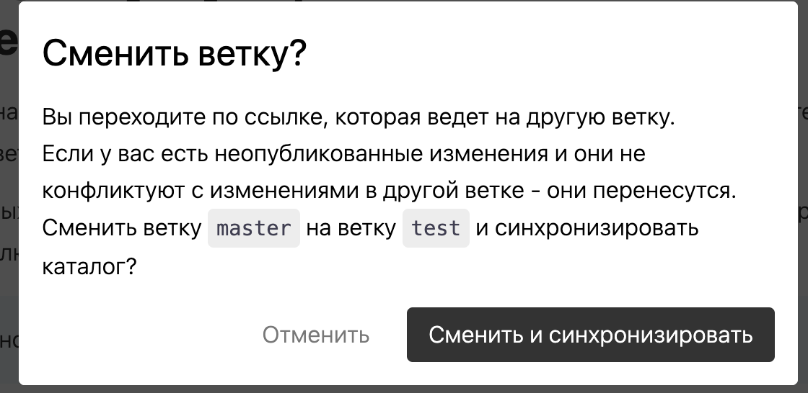

Сейчас у нас есть неочевидная логика от гита, когда при переключении ветки контент переносится из одной ветки в другую.

Для рядовых пользователей это неочевидное поведение и правильнее будет не переносить контент при переключениях.

:::tip 

Можно сделать через автостеш, автокоммит или ещё как-то.

:::

## Критерии

1. При переключении ветки можно выбрать, сохранять изменения в стеш или переносить их в другую ветку

   [comment:5]*Чекбокс*[/comment] *(по умолчанию **выкл**)*: [comment:7]Перенести изменения [/comment](**Придумать текст**)

   1. Если чекбокс **вкл.**, будет использоваться текущая логика смены ветки -- чекаут, а в случае конфликта ошибка

   2. Если чекбокс **выкл.**, будет использоваться новая логика -- стеш, чекаут и применение стеша при возвращении на исходную ветку

   3. В [comment:6]модальном[/comment] окне “Сменить ветку?“ присутствует такой же чекбокс

      *Текст окна*: (**Придумать текст**)

      

2. [comment:1]При переключении ветки[/comment], локальные изменения пользователя отправляются в стеш с именем `gramax-autostash-<branch-name>`, где `branch-name` -- ветка, **с** которой пользователь переключается

   1. Если стеш с таким именем уже существует, он применяется и сразу создаётся новый, который содержит в себе изменения обоих стешей

   2. При возникновении конфликтов вызывается окно решения конфликтов

3. После переключения ветки, приложение всегда проверяет, присутствует ли стеш с названием `gramax-autostash-<branch-name>` и применяет его, где `branch-name` -- ветка, **на** которую пользователь переключается

   1. При открытии каталога проверяется, присутствует ли стеш с таким названием

      Если присутствует, стеш автоматически применяется