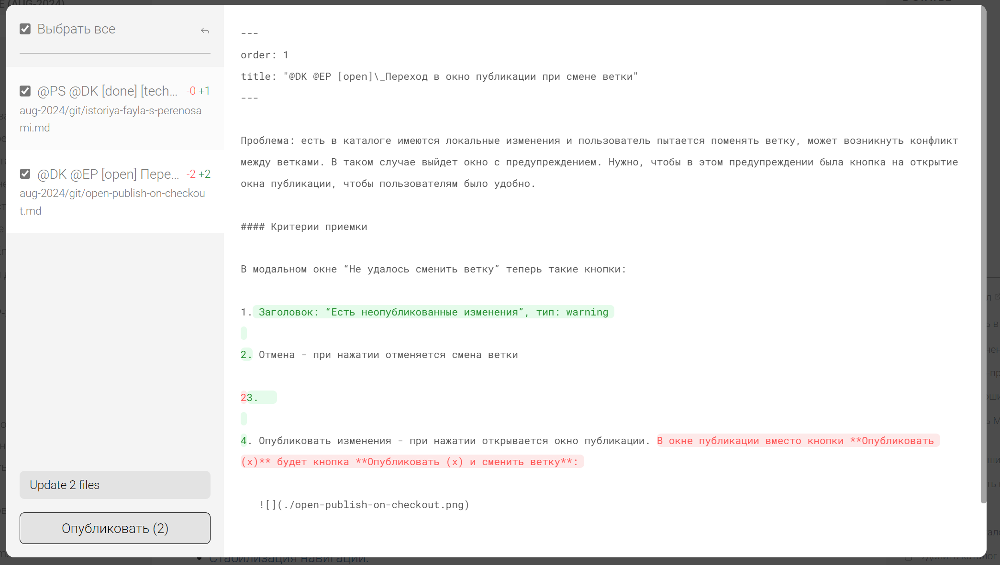

Проблема: есть в каталоге имеются локальные изменения и пользователь пытается поменять ветку, может возникнуть конфликт между ветками. В таком случае выйдет окно с предупреждением. Нужно, чтобы в этом предупреждении была кнопка на открытие окна публикации, чтобы пользователям было удобно.

#### Критерии приемки

В модальном окне “Не удалось сменить ветку” теперь такие кнопки:

1. Заголовок: “[icon:circle-alert] Есть неопубликованные изменения”, тип: warning

2. Кнопка: Отмена - при нажатии отменяется смена ветки

3. Кнопка: “Опубликовать изменения” - при нажатии открывается окно публикации.

   

Исходная заявка: <https://support.ics-it.ru/issue/GXS-1741>\>