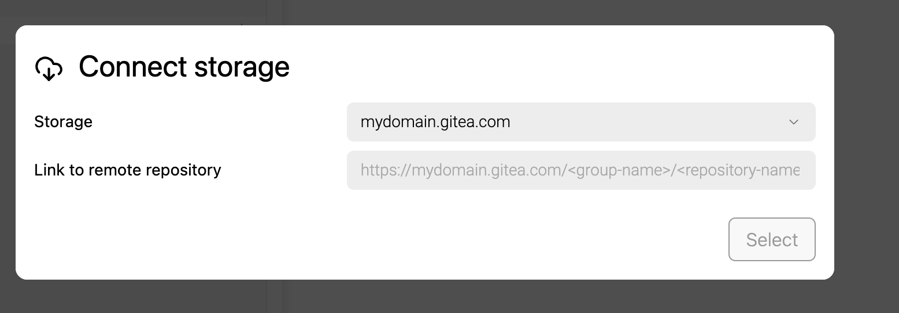

-  [comment:Mtzj2]Не можем пока поддерживать[/comment]

   -  Gitverse: `https://gitverse.ru/sc/gitverse/roadmap.git`

   -  Azure Repos: `https://dev.azure.com/group-name/rep-name/_git/rep-name`

   -  AWS CodeCommit: `https://git-codecommit.us-east-1.amazonaws.com/v1/repos/rep-name`

   -  Phabricator: `https://phabricator.yourdomain.com/diffusion/CAT4/rep-name.git`

-  Надо добавить возможность использовать домены не в латинице (.рф домены и прочее)

-  Надо сделать переключалку для гитлаба, чтобы была кнопка входа в gitlab.com

---

-  Добавить возможность привязывать созданные через грамакс каталоги в хранилище

   Не понял проблемы. В моём понимании - у хранилище есть домен и ещё имя. Например, чел хочет привязать к своему gitea хранилищу:

   1. Нажимает кнопку “Подключить хранилище”

   2. Добавляет новое хранилище:

      1. Домен - `gitea.custom-domen.com`

      2. Название - `Gitea`

      3. Вставляет свой токен, имя пользователя, почту

   3. Добавляется новое хранилище с названием Gitea (оно должно быть уникальнымнаверное)

   4. Чел выбирает Gitea

   5. Появляется новое поле снизу “Ссылка на удалённый репозиторий”

   6. Чел создаёт в gitea репозиторий. Копирует в новое поле сслыку на только что созданный репозиторий (под капотом это будет `git remote add {ссылка на gitea}`

   7. Каталог пушится в удалённый репозиторий

Примерный дизайн:

