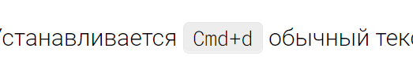
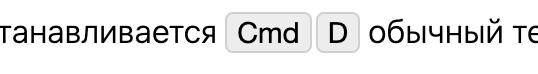
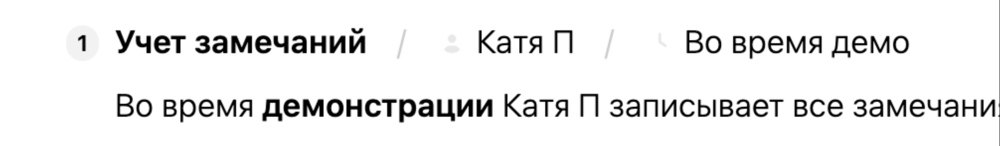
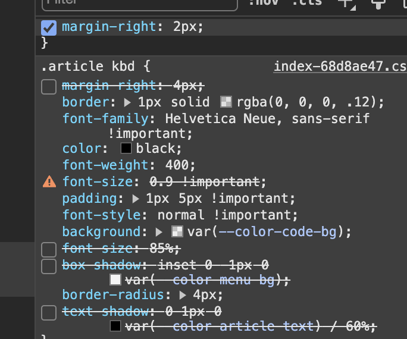
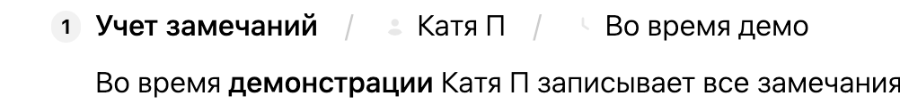

### Итог

-  Сделал kbd, Стас сказал, что не то, поэтому заявку закрыли.

-  Сделать us по дизайну cmd и kbd, затем описать их работу, после чего разработать.


**Референсы:**

-  notion;

-  paper.

[cmd:cmd]

[kbd:kbd]

#### Информация:

1. Тег `<kbd>` используется для обозначения текста, который представляет собой ввод с клавиатуры.

   ```
   Нажмите <kbd>Ctrl</kbd> + <kbd>C</kbd>, чтобы скопировать текст.
   ```

2. Тег `<cmd>` используется для обозначения команд, которые пользователь может выполнить.

   ```
   Чтобы запустить программу, введите <cmd>run program</cmd>.
   ```

### Критерии:

1. изменен [блок ](./../../../jun-2024/_index)kbd:

   -  имеет новые вид:

      

      

   -  когда есть хоткей (слитное слово съеденное между собой `+`), тогда блок разделяется, на количество `+`:

   -  когда перед `+` стоит `\`, тогда он отображается как обычный текст, не разделяясь; ?

2. увеличить размер жирного шрифта в редакторе до 600 пунктов;

   -  (ширина шрифта у нас сейчас 500 пунктов, в референсах 600 пунктов).

      

      

3. поменять border-radius у элементов в соответствии с задачей - <https://support.ics-it.ru/issue/UX-107>.

---

1. **Скругления привести к одному виду**. Есть такая концепция в UX, что чем элемент больше, тем больший радиус он должен иметь. У нас сейчас радиусов меньше чем нужно (1 или 2?).

   Предлагаю их поделить на разные размеры:

   -  `small` -- Для чипсов внутри инпутов (o2m и пикер с labelStyle), хоткеев -- 3px

   -  `normal` -- Для инпутов, кнопок (в т.ч. в тулбарах), тултипов -- 4px

   -  `large` -- Дропдауны, меню, тулбары -- 6px

      *(тут есть сложность, что если относительно другого элемента, то прижатый к нему край должен быть без радиусов, т.е. надо учитывать положение дропдауна относительно элемента от которого он открывается)*

   -  `x-large` -- Окна и большие элементы -- 8px

2. **Стили** `kbd`. Изменить стили kbd, чтобы из \[kbd:Cmd+D\] получалось вот это:

   

   

3. **Жирный жирнее**. Утолстить жирный. Сейчас он 500. Сделать 600. Было/станет:

   

   

4. **Иконка *Откатить все***. В окне коммита для массовой отмены поменять иконку на  [icon:arrows-turn-right] только развернутую по горизонтали.


## Исходные заявки

-  <https://support.ics-it.ru/issue/GXS-1308>

-  <https://support.ics-it.ru/issue/GXS-1737>