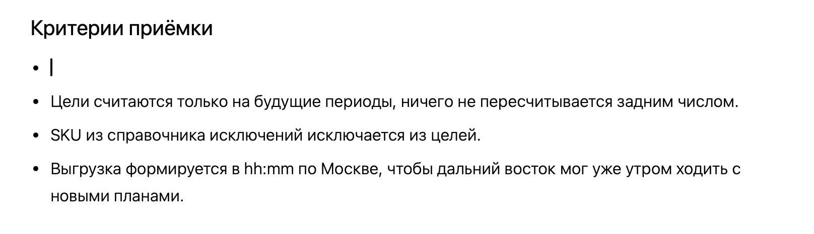
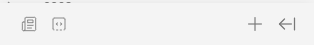
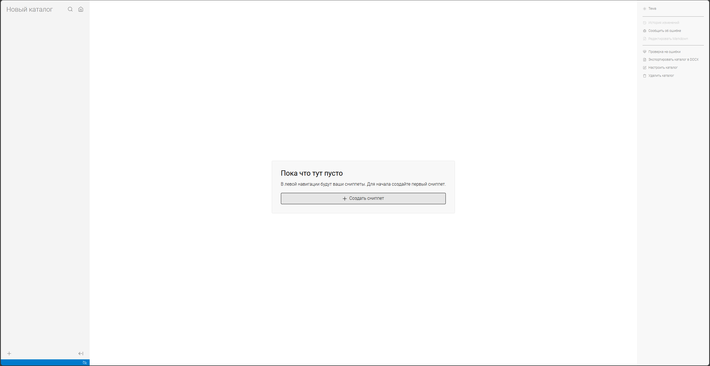

**Битые ссылки на** **сниппеты**.

-  В интерфейсе *Проверки на ошибки* битые ссылки на сниппеты отображаются в отдельной секции и логика полностью повторяет логику битых ссылок на статьи.

-  При отображении статьи если сниппет не найден выдается стандартная ошибка рендеринга (потом ее задизайним, пока она красный note).

**Расширенное форматирование в содержимом**.

-  Сейчас пока обрезок. Надо добавить возможность вставить картинки и другие элементы.

**Управление уровнем вложенности сниппетов.**

-  Сделал список в сниппете, хочу поместить его внутрь другого списка, но нельзя.

   

### Критерии:

1. Добавить в `Проверка на ошибки` сниппеты отдельной секцией с логикой битых ссылок.

2. При отображении статьи, если сниппет не найдет, выдается стандартная ошибка рендеринга.

3. Создание и редактирование сниппетов

   1. [comment:gY1Xi]Переключение[/comment] рабочей области (от сниппетов к статьям и наоборот) через иконки

      

      1. [icon:newspaper] -- переключение на статью

      2. [icon:square-dashed-bottom-code] -- переключение на сниппеты

      3. [icon:plus] -- перенесен вправо

   2. Окно, если отсутствуют сниппеты

      

   3. [comment:nBMbq]Редактирование[/comment] свойств сниппета происходит в таком же окне, как редактирование статьи.

      [image:./sy-open-dorabotka-snippetov-4.png:::20.172,10.3581,59.5886,18.2864:]

4. Все ресурсы хранятся в ./snippets/krutoy-snippet/, где: krutoy-snippet -- папка с id сниппета.

5. Добавить поддержку всех компонентов из стандартного редактора.

6. Возможность управлять вложенностью сниппета в списках.

7. Если сниппет не найден, то выдает ошибку рендера (ждемс дизайнера 😎)