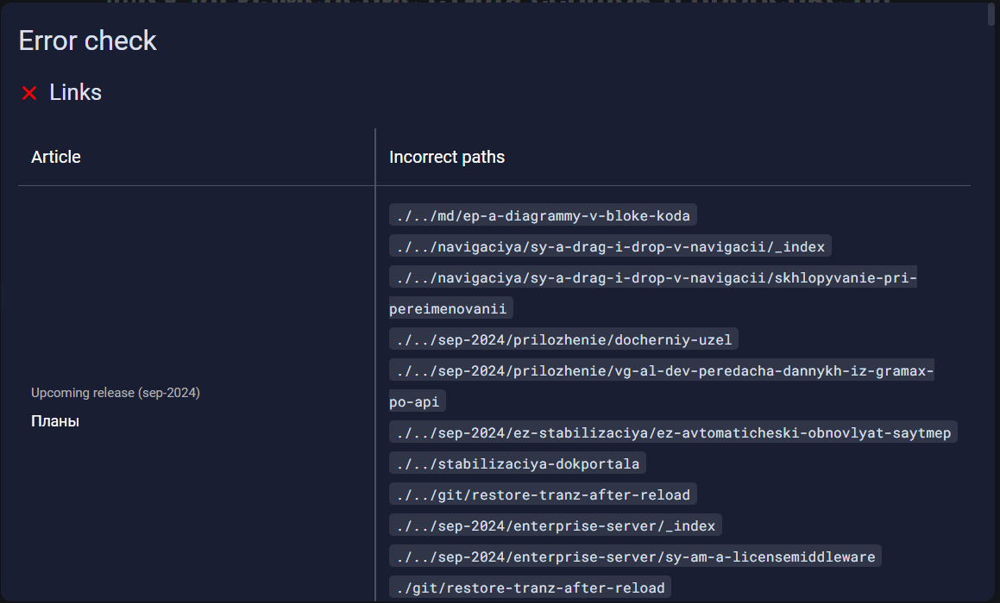
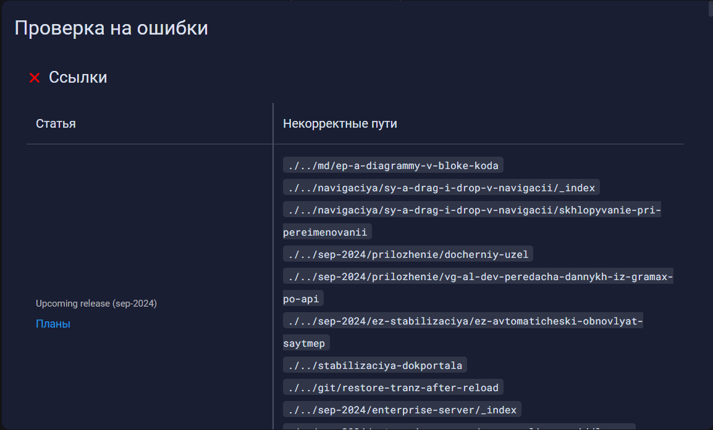

Суть проблемы заключается в том, что сейчас ссылки на статьи в проверке на ошибки не выглядят как ссылки и невозможно понять, что по ним можно перейти, пока не увидишь тултип при наведении на название статьи.

Решение проблемы простое: изменить цвет ссылки на стандартный - голубой

## Критерии

-  Новый цвет у ссылки на статью - голубой

-  Убран тултип

