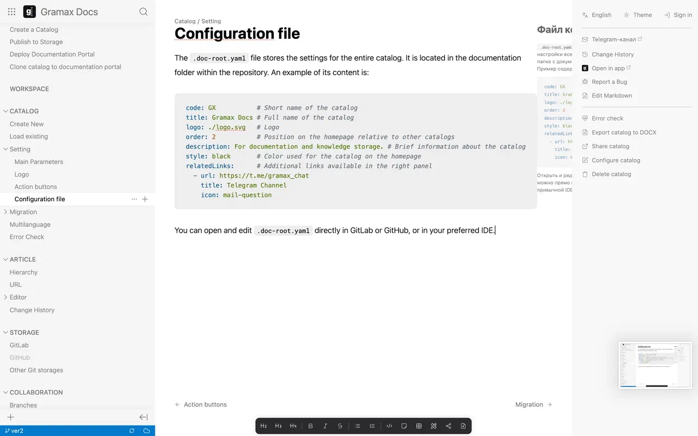

К [реализации мультиязычности](./../../released/aug-2024/lang-toggle/multilang-docs) возникло много замечаний, их количество тянет на отдельную задачу.

## Что сделано

1. Тултипы для переключателя языков

2. Один конфирм для удаления: либо наш, либо `window.confirm` в зависимости от значения чекбокса “Больше не показывать”

3. Состояние чекбокса сохраняется после нажатия “Продолжить”

4. Докпортал: категории, которые не имеют ни одной переведённой статьи (в том числе вложенной), теперь не отображаются

5. Исправлен баг, когда ломался каталог при добавлении языка, если .doc-root.yaml был вложенным

6. Дропдаун с ссылками отображает статьи/категории только текущей локализации

1. Конфирм не показывается, если в пропсах статьи изменился только заголовок

## Замечания

### Превью статьи на дефолтном языке

1. Сейчас превью очень узкое, надо сделать пошире. **На сколько и за счёт чего? Промежуток между навигацией и статьёй уменьшить?**

2. Делать активный абзац непрозрачным. **Это может быть сложным и это  обращаться к @SF или @NV**

3. Исправить вёрстку: сделать отдельный скролл (превью sticky), отступы, сплющился видос

   

### Именование языков

Не замечание, а открытый вопрос. От @AM. Как именовать языки? Стоит ли писать на одном языке (интерфейса)?

Телеграм именует их на их собственных языках: English, Русский.

### Исправить вёрстку переключателя языка справа сверху