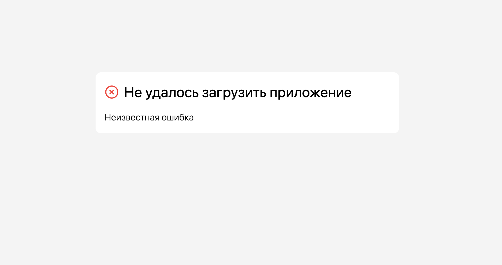
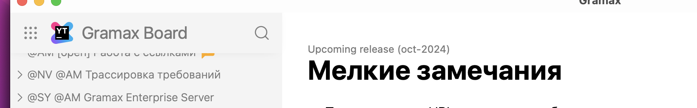
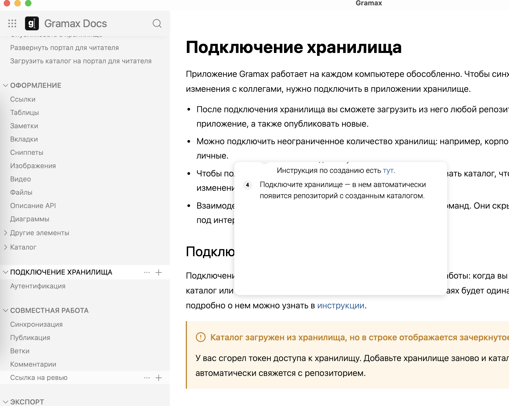

-  При изменение URL страницы не обновляются ссылки в статьях.

-  При переходе по ссылке не скролится левая панель.

-  При изменении структуры статьи не обновлется правая панель.

-  Если нет интернета, то видео со стримингов отображаются белым прямоугольником. Надо писать про проблемы с соединением.

-  Открыл [app.gram.ax](http://app.gram.ax) без интернета, там что-то непонятное. Предлагаю писать про ошибку соединения или вообще настроить офлайн работу.

   

-  Слишком большой отступ перед заголовком сверху брэдкрамбов.

   

-  При ховере на ноут-блок хочу сразу выбирать какой ноут-блок добавить по цвету.

-  В превью маленькой статьи гигантский отступ снизу.

   
