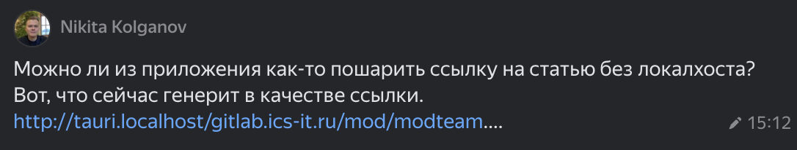

В десктопном приложении используется дефолтное контекстное меню webview. Некоторые пункты из которого работают не так как хотелось бы: например, копирование ссылки использует домен `tauri.localhost` вместо `app.gram.ax`.

[image:./zamenit-defoltnoe-kontextnoe-menyu.png::Стандартное контекстное меню:0,0,100,100:49:]

Необходимо реализовать своё контекстное меню, при помощи которого мы сможем правильно реализовать копирование ссылки, а также добавить свой функционал.

Нужно учесть, что на некоторых элементах стоит оставить стандартное меню.

[image:./zamenit-defoltnoe-kontextnoe-menyu-2.png::Контекстное меню у редактируемого элемента:0,0,100,100:56:]

:::lab Происследовать

Возможно ли изменить домен `tauri.localhost` на кастомный? Из того, что сейчас известно: придётся использовать форк Tauri, потому что публичный API не позволяет задать кастомный домен.

:::

## Критерии:

1. Пользователь может скопировать ссылку при помощи контекстного меню с правильным доменом: `app.gram.ax`/`dev.gram.ax`, а не `tauri.localhost`