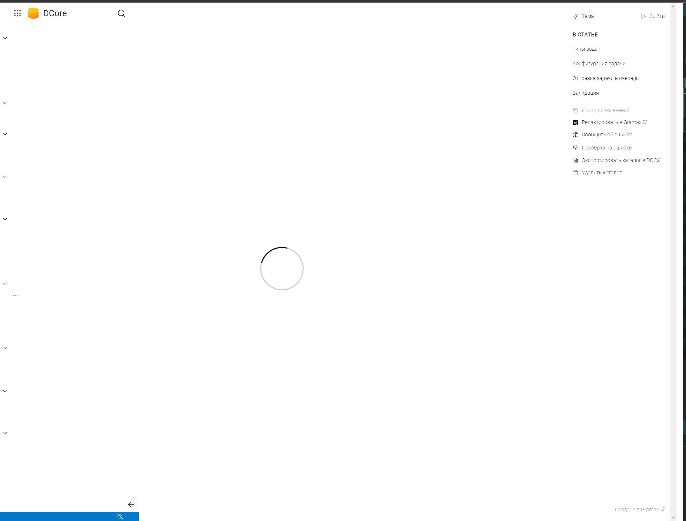
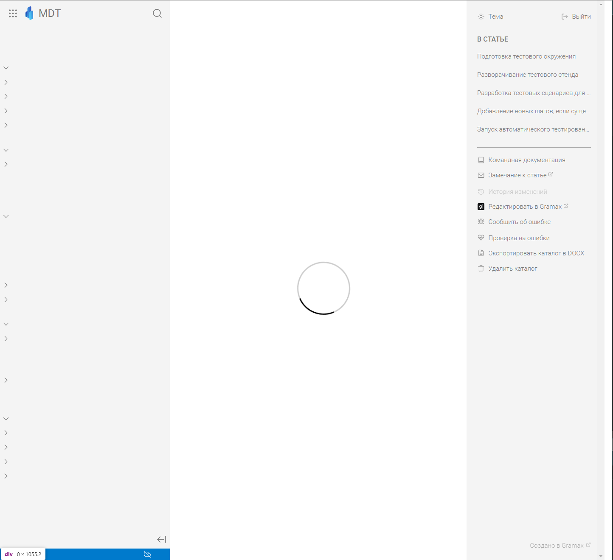
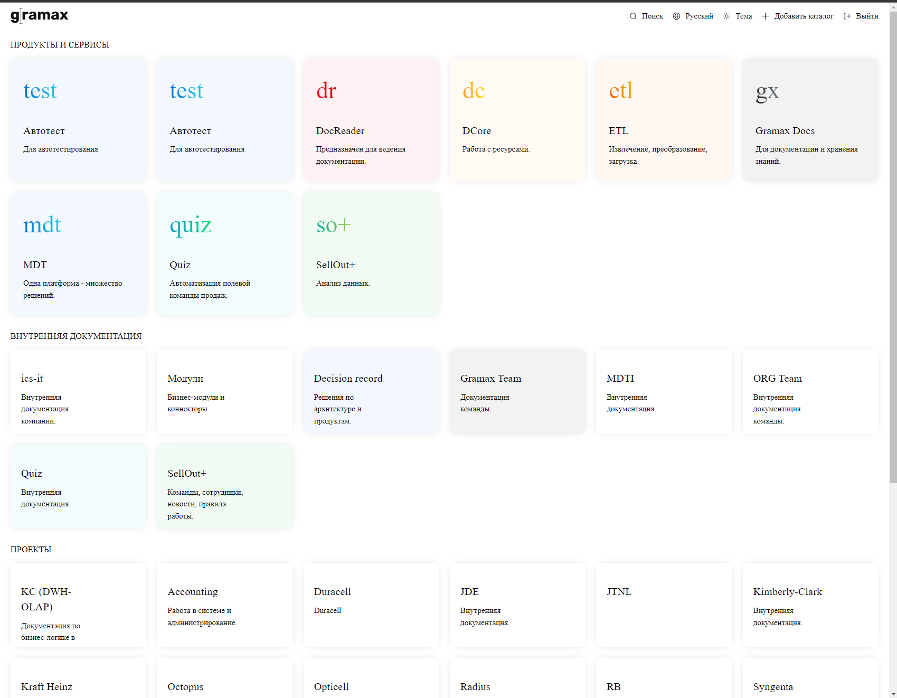
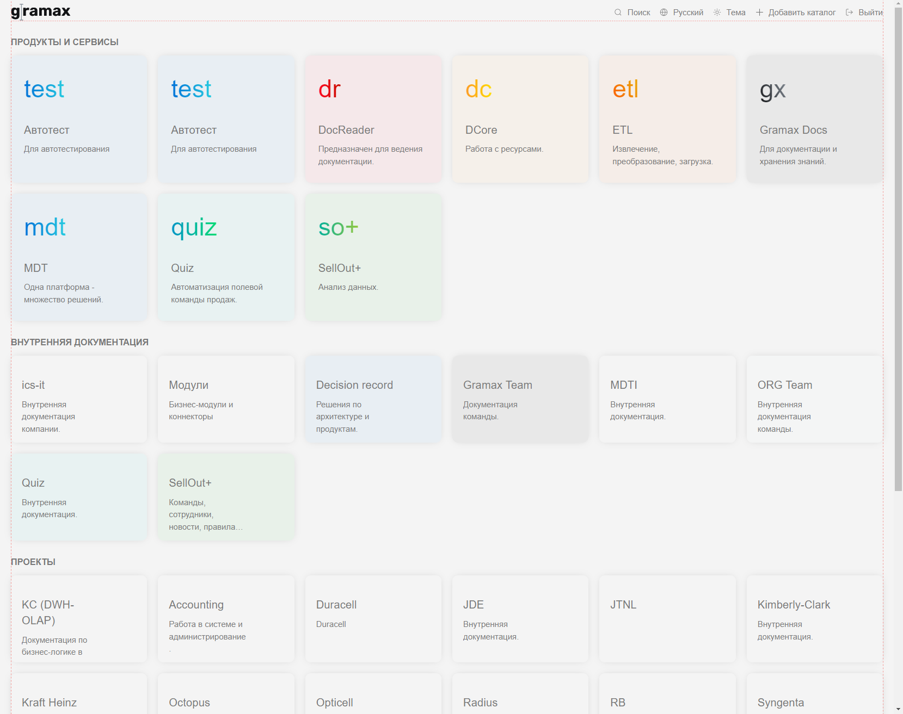

Сейчас если проблема, при загрузки портала или приложения, стили выглядит не очень красиво и иногда мерцает со светлой на темную ( ночью не комфортно открывать gramax ). Выглядит как баг и недоработка.

Нужно сделать приятные стили.

Исходная заявка -- <https://support.ics-it.ru/issue/GXS-1949>

### Загрузка статьи

:::info:true Как сейчас

:::

:::info:true Как будет

:::

### Загрузка главной

:::info:true Как сейчас

:::

:::info:true Как будет

:::

### Критерии

-  При загрузке портала или [приложения](), видны стили:

   1. Скроллбаров;

   2. Стили текста:

      -  цвет;

      -  когда нету основного шрифа, тогда используется sans serif, а не serif.

   3. На главной:

      -  заднего фона.

   4. В статье:

      -  стили сайдбаров.

-  Как только страница загружается, должна показана тема, определенная на устройстве:

   1. При первом использовании gramax по умолчанию берется системная тема:

      -  если системную тему не удалось определить, тогда по умолчанию будет выбрана светлая тема.

### Оценка

-  анализ: 2ч;

-  реализация: 16ч;

#### Исходная заявка

-  [GXS-1949](https://support.ics-it.ru/issue/GXS-1949) - Темная тема в докпортале;

### Замечания:

-  логотип первоночальной загрузки в темной теме почему то не с серой палочкой разделения (как в светлой теме), а белая

-  Докрутить дехеширование темы пользователя при входе

