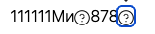

После перехода с иконок `fontawesome` на `lucide` в старых статьях где использовалась конструкция `[icon:{code}]` код иконок может не совпадать и такие иконки сломаются. Хотелось бы чтобы у пользователей ничего не ломалось.

**Критерии приемки:**

-  \[x\] Если есть рядом с `.doc-root.yaml` директория `.icons/`, то считаем, что иконки сначала ищем в ней (т.е. svg-файлы по коду, `{code}.svg` )

-  \[x\] Если не нашли, то берем системные `lucide`

-  \[x\] В *Проверка на ошибки* проверяются некорректные иконки в статьях

   -  Столбцы у таблицы

      -  Статья

      -  Некорректные иконки

**Замечания:**

-  Иконки не по центру, поднять повыше:

   

   Исправится в рамках [**@VG \[a\] Компонент icon-picker**](./../../../apr-2024/dev-komponent-icon-picker.md)