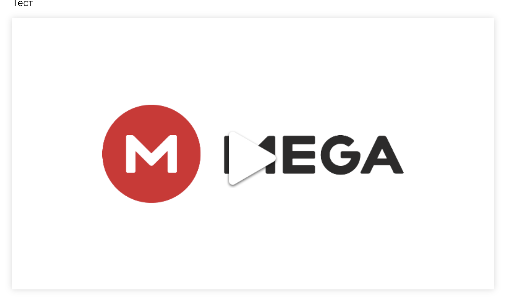
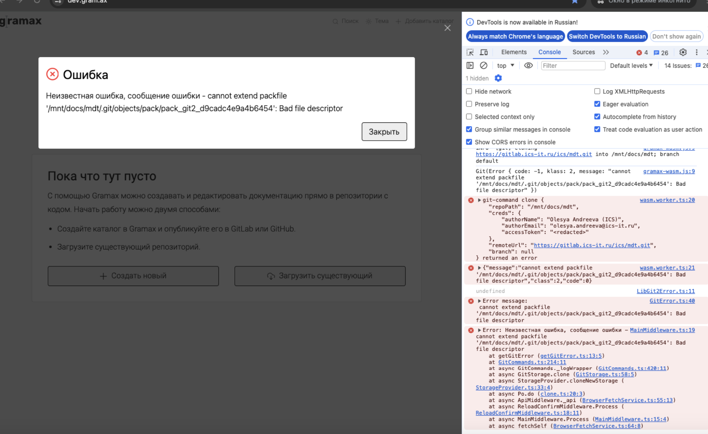
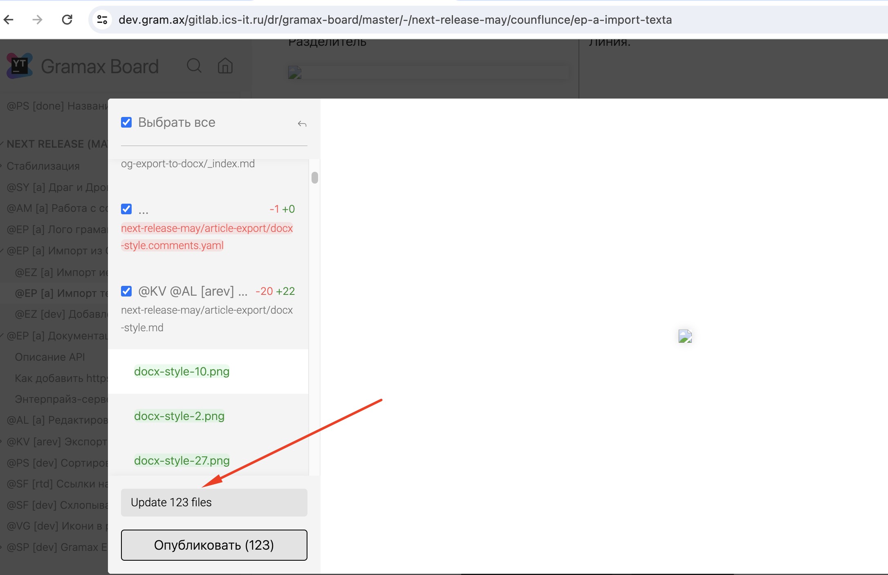
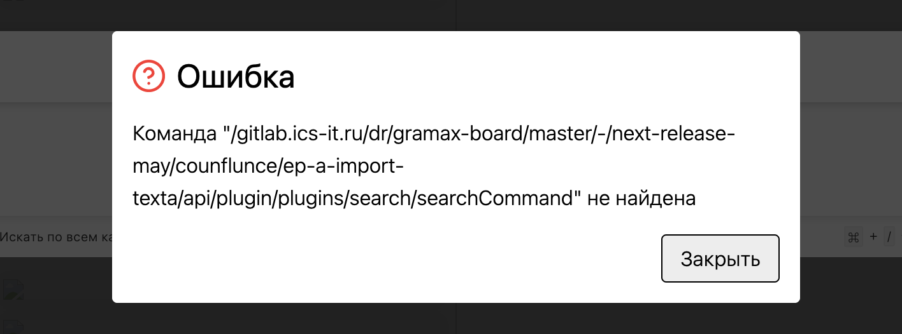

Сейчас в браузерной версии не поддерживаются все возможности git-a. Из-за этого мы не можем решить некоторые виды конфликтов и git в браузере работает медленней. Хотелось бы, чтобы в браузере не было таких проблем.

### Критерии

-  В браузерной версии приложения [некоторый]() функционал работы с гитом начнет работать быстрее

[cut:Скорость выполнения функций гита:false]

Репозиторий: `gramax-board`. Количество файлов: \~600; коммитов: \~1300.

Браузер: `Firefox`.



---

*  

   Функция

*  

   isomorphic-git

*  

   libgit2

*  

   Разница

   **(меньше -- лучше)**

---

*  

   Клонирование

*  21 342ms

*  20 964.36ms

*  

   \-2%

---

*  

   Переключение ветки

   (нет изменений)

*  2 963ms

*  2 002.34ms

*  

   **\-48%**

---

*  

   Переключение ветки

   `master` --> `kanban`

   (много изменений)

*  5 568ms

*  5 440.76ms

*  

   \-2%

---

*  

   Окно публикации

   (мало изменений, 2 файла)

*  986ms

*  1 269.14ms

*  

   **\+22%**

---

*  

   Окно публикации

   (много изменений, 300 файлов)

*  99 761ms

*  8 729.34ms

*  

   **\-91%**

---

*  

   Публикация

   [comment:1]**есть ли разница при кол-во файлов (1, 10, 100)**[/comment]

*  1 332ms

*  2 463.32ms

*  

   **\+84%** (!!!)

---

*  

   Создание ветки

*  136ms

*  329\.34ms

*  

   **\+59%** (!!)

---

*  

   Мерж

*  7 112ms

*  8 425.78ms

*  

   \+16%



[/cut]

-  При первом запуске приложения, необходимо будет мигрировать все файлы. Миграция будет происходить следующим образом:

   -  Появляется текст, который показывает статус переноса.

      -  *Заголовок*: Нам нужно обновить ваши файлы

      -  *Тело*: В новой версии мы ускорили операции с Git. Для корректной работы нужно перенести ваши файлы со старой структуры на новую.

         Это займет пару минут.

      -  Крутилка с прогрессом “обработанные файлы/общее кол-во файлов”.

   -  После того как процесс миграции завершится пользователь видит главную страницу с каталогами.

   -  Если в результате миграции были выявлены какие-то ошибки, то открывается модальное окно поверх главной страницы:

      -  *Заголовок*: Не удалось перенести некоторые каталоги

      -  *Тело*: Пожалуйста, загрузите их заново:

         -  каталог

         -  каталог

         Если у вас были неопубликованные изменения, которые важно не потерять -- обратитесь в [*поддержку*](https://t.me/gramax_chat)*.*

   [cut:Технические детали миграции:false]

   -  Необходима для работы libgit2.

   -  При обновлении страницы процесс продолжается.

   -  При этом, если файл существует в новом хранилище (OPFS), он не переносится из старого хранилища (IDB), что позволяет не беспокоится о двух одновременно открытых страницах.

   -  Каталоги которые не перенесутся : `mdt`**,** `dcore`**,** `sellout`**,** `org-team`

   [/cut]

-  Приложение будет себя по разному вести в зависимости от используемого браузера.

   -  В браузерах `Chrome`, `Yandex`, `Edge`, `Opera` не появится новых ограничений.

   -  В браузерах `Safari >= 17.4` и `Firefox` будет заменена реализация видео. Будет выглядит следующим образом:

      [cut:Превью видео:false]

      Dropbox будет работать как раньше

      YouTube

      

      Mega

      

      Google Drive

      

      [/cut]

   -  В браузерах `Opera Mini`, `IE` приложение не будет работать. Будет выдаваться окно ошибки вида:

      -  *Заголовок*: Этот браузер не поддерживается

      -  *Текст*: Откройте Gramax в [другом браузере]() или [скачайте приложение Gramax](https://gram.ax/) на компьютер.

   -  В остальных браузерах в поддержка не гарантирована.

      -  Если приложение запускается, то будет заменена реализация видео (реализация выше).

      -  Если приложение не запускается, то будет выдаваться окно ошибки (реализация выше).

-  Есть документация о поддерживаемых браузерах ([https://gram.ax/resources/docs)](https://gram.ax/resources/docs)

### Технические детали

-  У нас будет свой инстанс drawio по URL-у `gram.ax/drawio`

---

## Миграция из IndexedDB в OPFS

Реализация файловой системы emscripten несовместима с lightning-fs, который используется сейчас. Пользователям необходимо будет переклонить каталоги. Но старые так и останутся мёртвым грузом висеть, будут недоступны.

Нужно сделать так, чтобы пользователи  могли использовать старые файлы. Поэтому необходимо будет сделать миграцию с IndexedDB в OPFS. Но есть некоторые ограничения:

-  Не всегда получается скопировать некоторые каталоги, посколько файлы в них бывают очень большими. В основном, проблема с `.pack` файлами гита, которые могут быть 200-500мб (у mdt, например).

-  Права файлов меняются с 644 на 755. Это создаёт кучу изменений без фактического изменения контента файла. По факту, не проблема, поскольку можно просто настроить гит.

-  После завершения миграции в IndexedDB создаётся пустой файл `.migrated`, из-за него миграция не будет запущена в следующий раз, а файлы в IndexedDB не удалятся. То есть останутсья там до того момента пока пользователь не очистит кэш браузера.

## Решение проблемы с заголовками для `SharedArrayBuffer`

### **Дочерние окна**

Из-за COEP, у дочерних окон нет ссылки на родительское окно (`window.opener = null`). У нас они используются для OAuth-авторизации. Данные можно перекинуть через LocalStoragе -- записать в дочернем окне, а в родительском дождаться появления нужной записи. Костыль, но напрямую функции родительского окна вызвать не получится.

### **IFrame в draw.io и видео**

#### **Использовать прокси для загрузки iframe / их скриптов.**

Не удалось. Либо скрипты загружаются не все, либо пытаются использовать наш же прокси для взаимодействия со своим API.

#### **Свой инстанс draw.io**

Поднять свой инстанс draw.io и при помощи Caddy добавлять необходимые заголовки. Будет находиться на домене **drawio.gram.ax** или **diagrams.gram.ax**

Образ draw.io: [jgraph/drawio](https://hub.docker.com/r/jgraph/drawio)

Примерный конфиг Caddy

```Caddyfile
localhost:8700 {
	redir /drawio /drawio/ permanent

	handle_path /drawio/* {
		reverse_proxy /* http://localhost:8080 {
			header_up X-Real-IP {http.request.remote.host}
			header_up X-Forwarded-Proto {http.request.remote.proto}
			header_down Cross-Origin-Embedder-Policy require-corp
			header_down Cross-Origin-Resource-Policy cross-origin
		}
	}
}
```

#### **Загружать картинку для видеохостингов и перенаправлять пользователя на новую вкладку**

В Google Chrome у `iframe` есть атрибут `credentinalless`, который позволяет им работать, но в Firefox его поддержки нет.

-  [YouTube](https://stackoverflow.com/questions/2068344/how-do-i-get-a-youtube-video-thumbnail-from-the-youtube-api)

-  [GDrive](https://stackoverflow.com/questions/57585838/how-to-get-thumbnail-of-a-video-uploaded-to-google-drive) -- хоть и отдаёт изображение по API, но не работает из-за COEP.

-  MegaNZ  -- нет возможности. Думаем просто отображать их логотипы.

-  Dropbox -- использует тег `video`. Всё должно работать и так.

## Хранение файлов

У Emscripten много [разных спобосов](https://emscripten.org/docs/api_reference/Filesystem-API.html#filesystem-api-filesystems) хранить файлы. По умолчанию использует `memfs` и хранит в памяти, но можно смаунтить другие.

**Asyncify.** [Вопрос в репе Emscripten про Asyncify](https://github.com/emscripten-core/emscripten/discussions/21666). Попытка использовать `ASYNCIFY` успехом не увенчалась. Запустить получилось, но производительность слишком низкая.

**pthreads.** Можно использовать `pthreads`, его производительность намного лучше, но для своей работы ему необходим `SharedArrayBuffer`, использовать который можно только с заголовками `"Cross-Origin-Opener-Policy": "same-origin"`, `"Cross-Origin-Embedder-Policy": "require-corp"`.

Эти заголовки блокируют использование большинства `iframe` / дочерних окон. Можно даже сказать, что всех внешних.

**JSPI.** Его производительность около `Asyncify`, но ещё он требует включения эксперементального флага в хроме.

[cut:Эксперименты с записью в файл:true]

Время за 600 файлов по 200kb.

#### Блоками по 512b

-  `memfs` \~500ms

-  `asyncify` 5m

-  `jspi` 4m

-  `pthread` 5s

#### **весь буфер:**

-  `memfs` \~30ms

-  `jspi` 1\.8s

-  `asyncify` 3s

-  `pthread` 0\.6s

[/cut]

## Компиляция wasm-git

Оказалось, что скомпилировать его достаточно просто. Для этого нужен `emscripten` и `cmake`. Emscripten генерирует wasm-модуль и js-файл к нему.

## Компиляция rust & libgit2

Emscripten в том числе поддерживает и компиляцию rust в wasm-модули, поэтому не должно ничего помешать скомпилировать gramax-git в wasm, экспортировать его команды и использовать их.

Необходимо только правильно настроить билдскрипт для libgit2, вот с этим могут возникнуть трудности.

#### Замечания:

-  \[x\] В режиме инкогнито ошибка при добавлении каталога МДТ.

   

-  \[x\] После синхронизации в окне публикации у меня появились 123 изменений, хотя я не вносила никакие изменения. Картинки ломаются.

   

-  \[x\] Поиск не работает.

   