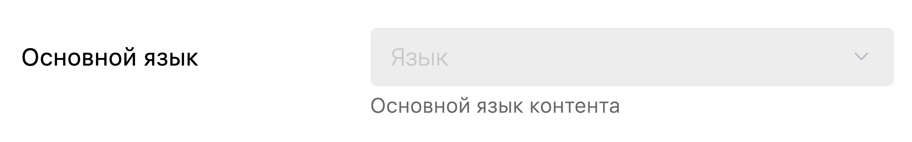
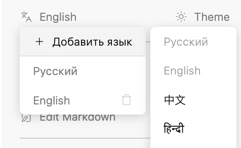

Ранее у нас был механизм переключения языка статей, но мы его отключили из-за того, что он был неочевиден и пользоваться им было неудобно.

Тем не менее, это очень важный функционал, который необходимо вернуть и довести до ума.

## Критерии

### Основной язык

Основной язык можно настроить в меню “Настроить каталог“, под пунктом “Директория“ находится выпадающий список с доступными языками

(**Придумать текст**)

### Переключение языков

Переключение языка контента работает по разному на докпортале и в редакторе.

1. В редакторе переключение языка контента осуществляется при помощи кнопки “[icon:languages] <language>”, а язык интерфейса переключается на главной странице при помощи кнопки “[icon:globe] <language>”

   1. Если основной язык не задан, переключатель языка контента недоступен -- горит серым

      Тултип: (**Придумать текст**)

2. На докпортале переключатель языка переключает как язык контента, так и язык интерфейса

   1. Если интерфейс не поддерживает язык контента, например, китайского, то используется стандартный язык для отображение интерфейса -- английский

### Управление языками

В редакторе в меню переключения языка контента первым пунктом находится “Добавить язык“, при наведении на него пользователь может увидеть, какие языки он может использовать.

1. Пользователю доступны 17 популярных языков: `Русский`, `English`, `中文`, `हिन्दी`, `Español`, `Françai`, `العربية`, `Portugu`, `Deutsch`, `日本語`, `한국어`, `Italian`, `Türkçe`, `Nederlas`, `Polski`, `Svenska`, `Čeština`

2. Если язык уже используется в каталоге, то добавить его ещё раз нельзя, его пункт горит серым и нажать на него нельзя

   

### Отображение текущего языка в URL

Если текущий язык контента отличается от основого, он отображается в url страницы.

Если пользователь открывает url, в котором указан язык, на который каталог не переведён, то пользователя перенаправляет на основную локализацию

Примеры:

#### Выбран основной язык:

1. Редактор `/gitlab.ics-it.ru/dr/gramax-board/master/-/jul-2024/lang-toggle/multilang-docs`

2. Докпортал `/gramax-board/jul-2024/lang-toggle/multilang-docs`

#### Выбран неосновной язык -- в данном случае английский

1. Редактор `/gitlab.ics-it.ru/dr/gramax-board/master/-/en/jul-2024/lang-toggle/multilang-docs`

2. Докпортал `/en/gramax-board/jul-2024/lang-toggle/multilang-docs`

### Превью

Когда пользователь редактирует перевод статьи, то справа ему показывается референс -- рендерится полупрозрачная статья на основном языке. В статье рендерятся картинки, диаграммы и прочие ресурсы. Редактировать статью-референс нельзя.

:::tip 

Продумать дизайн, референс в описании эпика

:::

### Файловая структура

1. Структура файлов всегда синхронизирована (путь и порядок статьи одинаковый) между основным языком и локализациями -- при удалении, переименовании (перемещении), создании файлов, изменении порядка статьи, они изменяются во всех остальных локализациях тоже.

2. При добавлении нового языка, структура статей будет идентичная основному языку. Нетронутые пользователем статьи будут гореть серым.

#### Предупреждения о действиях

Если пользователь пользуется функционалом перевода статей (у каталога указан основной язык), то при попытке изменить файловую структуру (переместить статью, удалить, добавить и пр.) ему будет показано предупреждение, что аналогичный файл изменится и во всех других локализациях.

1. В модальном окне с предупреждением есть чекбокс “Больше не показывать“, который выполняет соответствующую роль

*Заголовок*: **(Придумать заголовок)**

*Тело*: **(Придумать текст)**

## Технические критерии

1. У каталога есть свойства `language` -- основной язык и `supportedLanguage` -- список поддерживаемых языков, который должен включать в себя `language`

## Замечания

-  \[x\] тут ошибка, писать “Основной язык“.

   [image:./multilang-docs-3.png:::37.0079,0,62.9742,100:58:]

-  \[ \] в десктопе в настройках каталога не меняется уже выбранный язык.

-  \[x\] в меню переключения языка остается удаленный язык [Запись экрана 2024-08-29 в 11.11.02.mov](<./Запись экрана 2024-08-29 в 11.11.02.mov>)