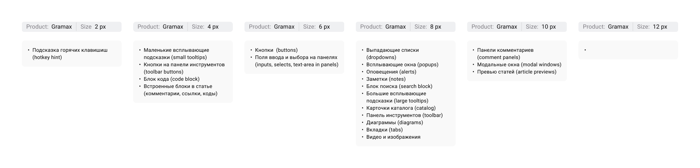
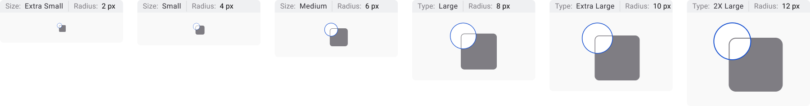

Эльмир подготовил бордер радиусы для интерфейса в Gramax, нужно их установить.

Ссылка на [макет.](https://www.figma.com/design/4ed1wT5Q53Q2ngP4Oex7f8/Gramax-приложение?node-id=1355-5774&t=4UZ7YvyeaFdoYIZc-1)

:::note:true Схема скруглений для интерфейса

:::

## Критерии

-  Текущие скругления в элементах соответствуют схеме скруглений.

## Технические детали

-  Переменные обновлены в соответствии с схемой типов и размеров скруглений

:::note:true Схема типов и размеров скруглений

:::

## Оценка

-  Анализ: 1ч;

-  Реализация: \~12ч.