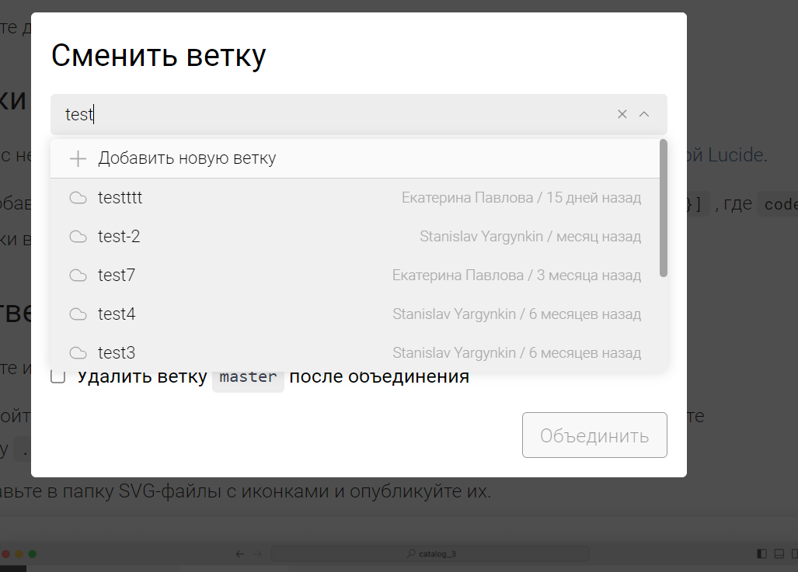
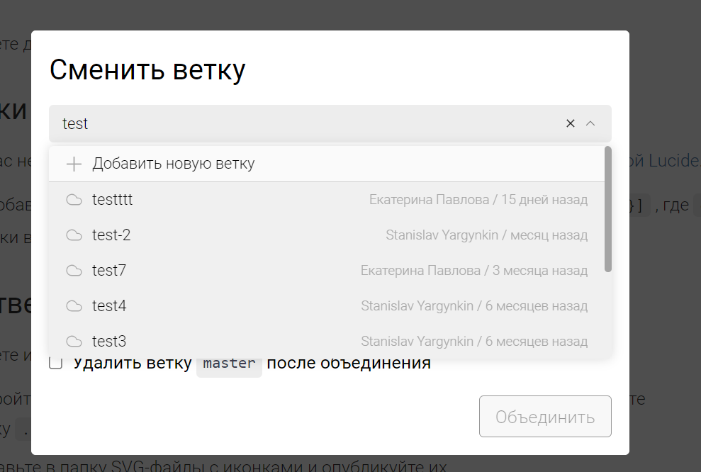

Сейчас в выпадающем меню с поиском нельзя удалить выбранный элемент, хотелось бы добавить крестик, который удаляет выбранный элемент,  во все инпуты с поиском.

## Референсы

-  [mui collection](https://mui.com/material-ui/react-autocomplete/)

:::note:true Дизайн инпута с крестиком

:::

:::note:true Дизайн инпута в ветках

---

:::

## Критерии

-  По нажатию на крестик, инпут очищается;

-  Крестик появляется, когда:

   -  есть текст и ховер на инпуте;

   -  есть текст и фокус в инпуте.

## Технические детали

:::note:true Детали

в пропсах ListLaout появляется два значения:

-  boolaen флаг, определяющий, будет ли в конце инпута крестик.

-  callback, который вызывается по нажатию на крестик.

:::

## Оценка

-  Анализ: 2ч;

-  Реализация: 6ч;