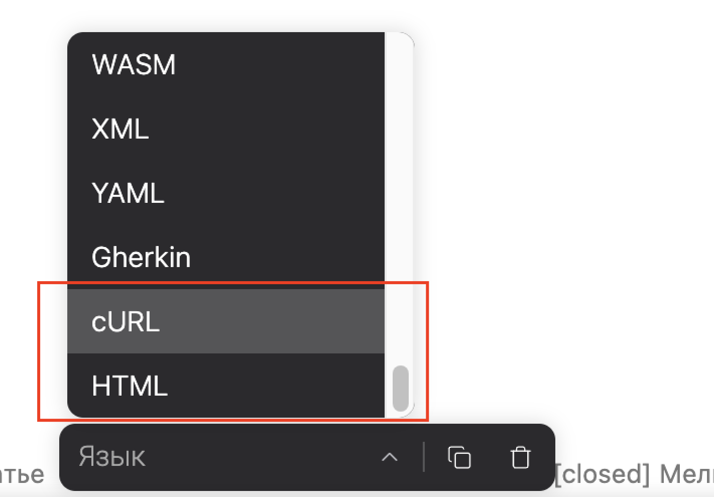

Одна из компаний, использует языки `html` и `curl`  в блоке кода, сейчас их у нас нету;

В темной теме при использовании языка `xml` в блоке кода, подсветка странно выглядит;

## Критерии

-  В блоке кода можно выбрать языки `curl` и `html`;

-  В темной теме подсветка `xml` и `html` выглядит корректно.

-  При выборе языка, названия отображаются в привычном для всех регистре.

## Оценка

-  анализ: 20м;

-  реализация: 2ч;

## Замечания

-  Языки сортировать в алфавитном порядке

   
