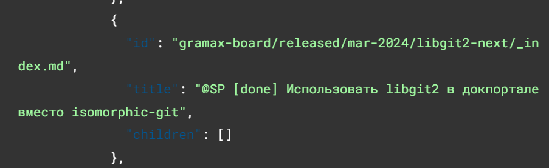
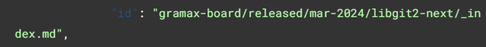
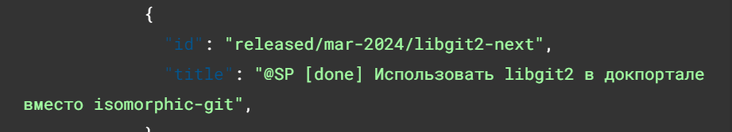

Сейчас при работе с Api можно заметить следующие проблемы

-  Если у статьи нет дочерних статей, то отправляется пустой массив

   

-  `ArticleId` содержит лишнюю информацию:

   -  Название каталога

   -  Расширение `.md`, а для разделов -- суффикс `/_index`.

## Критерии

-  Если массив дочерних статей пуст, его не надо возвращать.

-  `ArticleId` должен содержать только часть URL-адреса после названия каталога.

   -  Было

      

   -  Стало

      

-  обновить документацию