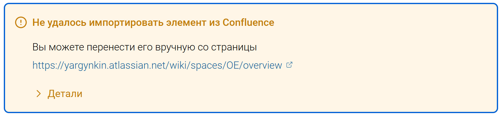

На основе компонента алерт необходимо разработать компонент для отображения ошибки импорта из Confluence. У компонента будет более лаконичный синтаксис в окне “Редактировать Markdown”.

## Критерии

1. На месте предупреждения о неудачном импорте элемента Confluence выводиться компонент предупреждения, состоящий из:

   -  Заголовок: «Не удалось импортировать элемент из Confluence»

   -  Текст: «Вы можете перенести вручную его со страницы. ***ссылка***»

   -  Сворачиваемый блок:

      -  Заголовок: «Детали»

      -  Код блок: *Код элемента*

2. У компонента появляется обводка при фокусе, тултип “Редактировать в Markdown” не отображается.



### Вид в редакторе Markdown

-  \[unsupported:url страницы:Название элемента\]

-  *Код элемента*

-  \[/unsupported\]

```
[unsupported:https://yargynkin.atlassian.net/wiki/spaces/%7E61fac4900d3777006a916fa4/pages/131154:anchor]

```JSON
{
 «type»: «inlineExtension»,
 «attrs»: {
  «extensionType»: «com.atlassian.confluence.macro.core»,
  «extensionKey»: «pagetree»,
  «parameters»: {
   «macroParams»: {},
   «macroMetadata»: {
    «macroId»: {
     «value»: «edbd712a-e8b9-4219-af50-dda8b07d2d47»
    },
    «schemaVersion»: {
     «value»: «1»
    },
    «title»: «Page Tree»
   }
  },
  «localId»: «479fbc97-c5ee-4f17-bc42-591dc7f45f4c»
 }
}


```