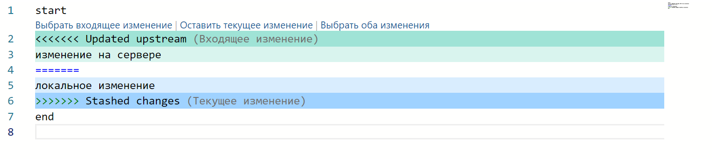
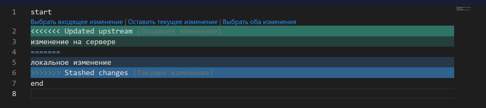
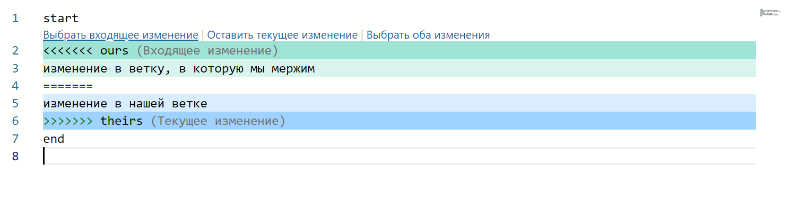
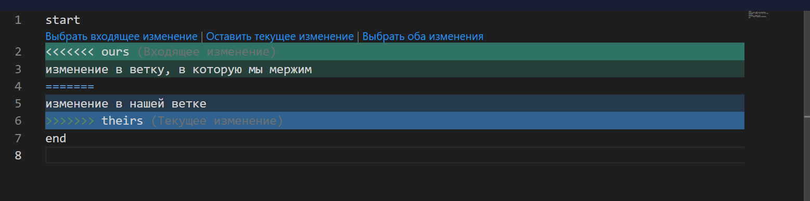
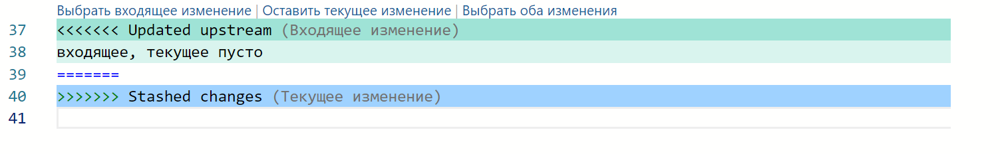
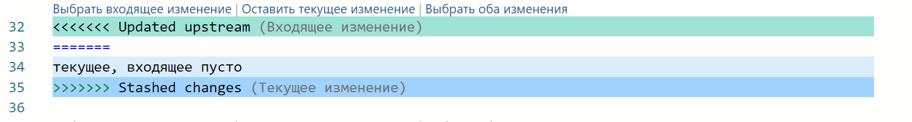
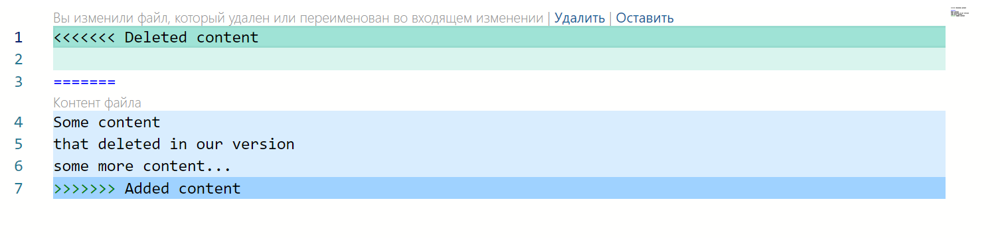

## **Проблемы**

1. Сейчас пользователь во время решения конфликта может в любое время закрыть модальное окно и репозиторий без предупреждений вернётся в состояние до конфликта, что может запутать пользователя

2. В Gramax существует логика, которая меняет конфликты местами с помощью специальных транзакций Monaco и она ломалась, если текущее/входящее изменение были пустой строкой. Лучше отказаться от какой-либо доп. логики в мерж конфликтах, чтобы все работало стабильнее

## Критерии

1. Если во время решения конфликта пользователь закроет модальное окно, показывается confirm:

   1. Объединение веток:

      -  Заголовок: Отменить объединение веток?

      -  Текст: При объединении веток возник конфликт. Для завершения объединения нужно его решить. Если это не сделать, объединение отменится.

      -  Кнопки:

         -  Решить конфликт -- (второстепенная) модальное окно с решением конфликта не закрывается.

         -  Отменить объединение -- (главная) при нажатии модальное окно закрывается, каталог возвращается в то состояние, в котором был до конфликта.

   2. Синхронизация:

      -  Заголовок: Отменить синхронизацию?

      -  Текст: При синхронизации возник конфликт. Для завершения синхронизации нужно его решить. Если это не сделать, каталог вернется в предыдущее состояние.

      -  Кнопки:

         -  Решить конфликт -- (второстепенная) модальное окно с решением конфликта не закрывается.

         -  Отменить синхронизацию -- (главная) при нажатии модальное окно закрывается, каталог возвращается в то состояние, в котором был до конфликта.

   **Ограничения**: если во время решения конфликтов закроется окно приложения, то репозиторий сломается и нужно будет его удалять.

2. Новая кнопка при решении конфликтов - “Выбрать оба изменения”. При нажатии выбирает оба изменения (в начале верхнюю часть конфликта, потом нижнюю). Дизайн представлен ниже

3. Все стили будут как в VSCode, за исключением кнопок. Кнопки будут цветом ссылки, при наведении мышкой подчёркнуты

4. Входящие изменения будут сверху и выделены зеленым цветом.

   Текущие изменения будут снизу и выделены синим цветом:

   -  Мерж со стешем (синхронизация):

      Светлая тема:

      

      Темная тема:

      

   -  Обычный мерж веток:

      Светлая тема:

      

      Темная тема:

      

5. Если конфилкт с пустой строкой, то выделение такое же, как и в vscode:

   Текущее изменение пустое:

   

   Входящее изменение пустое:

   

6. Конфликт с удалением файла оставляем как было:

   

## Тесты

Нечего тестить

## Оценка

7 часов