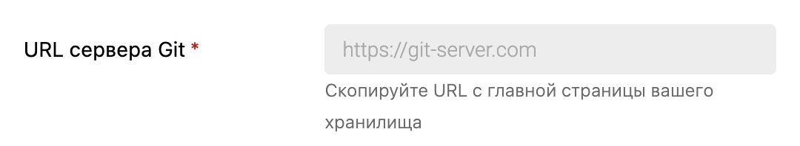
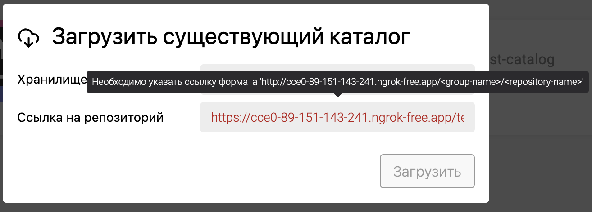
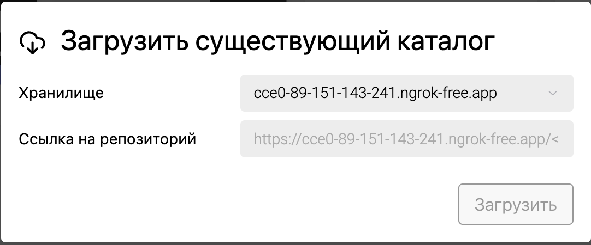
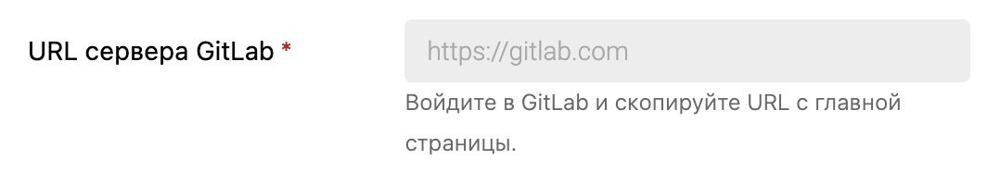
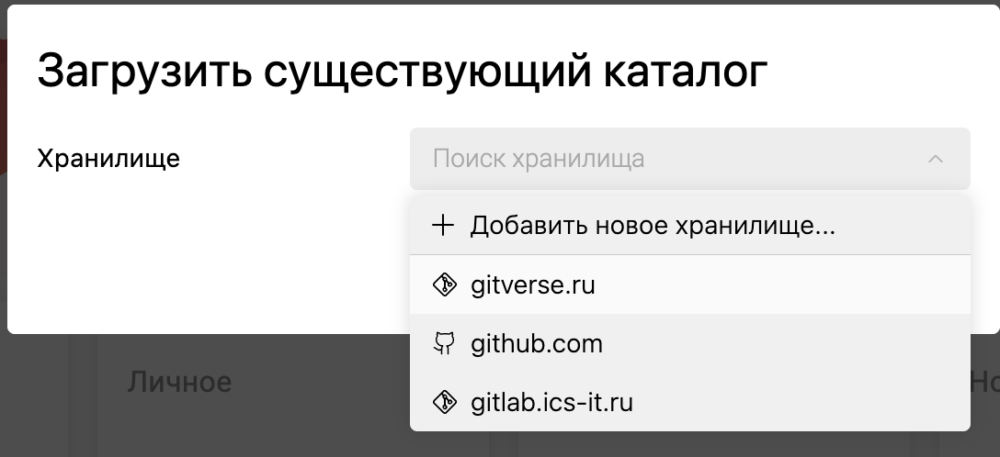

Сейчас хранилища у нас работают только с HTTPS-хранилищами, хотелось бы чтобы они работали и с HTTP-протоколом.

## Критерии

-  Для универсального Git:

   -  В окне добавления хранилища поле домена заменится на это

      

   -  В окне клонирования поменяется текст тултипа и плейсхолдер. Текст в них будет зависить от текущего домена и протокола.

      -  Тултип теперь будет в формате:

         -  Необходимо указать ссылку формата '/<group-name>/<repository-name>’

         -  До этого было:

            -  Домен у хранилища и репозитория не совпадает

            -  Необходимо указать ссылку формата 'https://git-server.com/group/repository’

      -  Прейсолдер будет в формате:

         -  StorageURL/<group-name>/<repository-name>

      

      

-  Для GitLab:

   -  В окне добавления хранилища поле домена замениться на это

      

-  Валидация полей URL-ов будет по правилу протокол + домен. Протоколы: пока только http:// или https://.

-  В списке хранилищ также показываются только домены, без протокола

   

-  В заголовок окна добавлена иконка [icon:cloud-download].

## Тесты

-  Нужно будет переписать текущие тесты под новые поля

## Оценка

-  Анализ: 2ч

-  Реализация: 6ч

## 