

---

*  

   Как выглядит в статье

*  

   Как выглядит на странице полученной по API

---

*  

   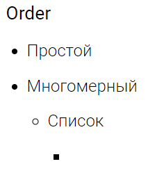

*  

   

---

*  

   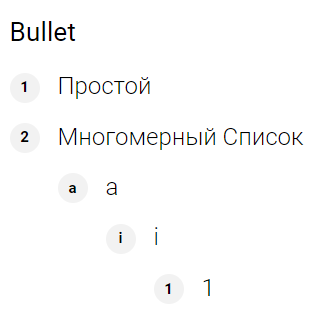

*  

   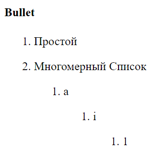

---

*  

   

*  

   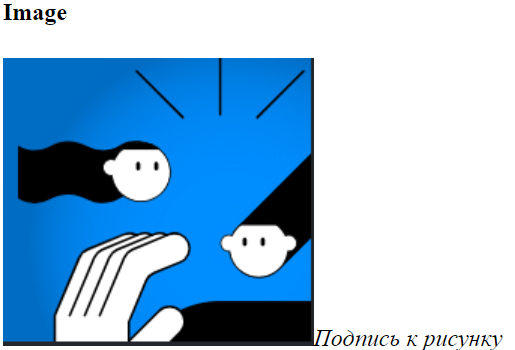

---

*  

   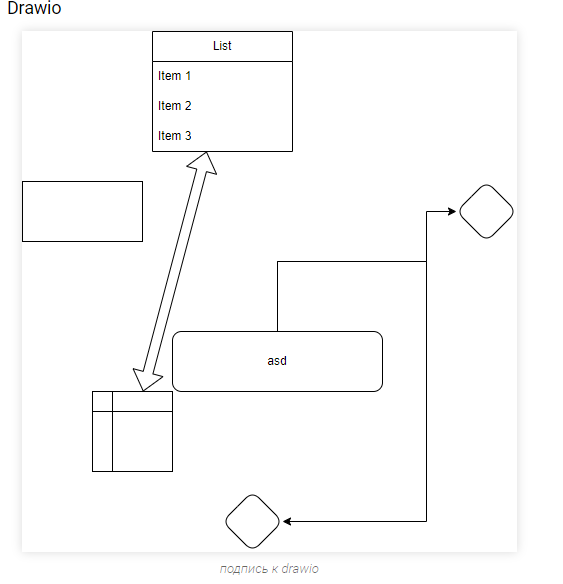

*  

   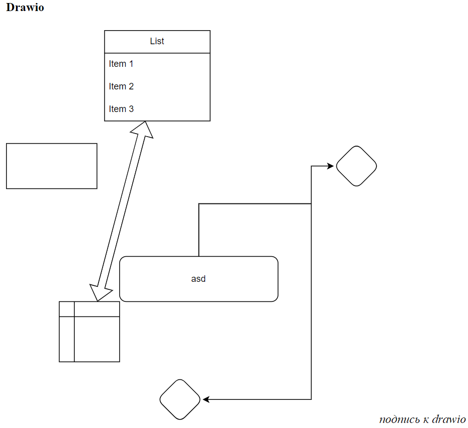

---

*  

   **DbTable**

   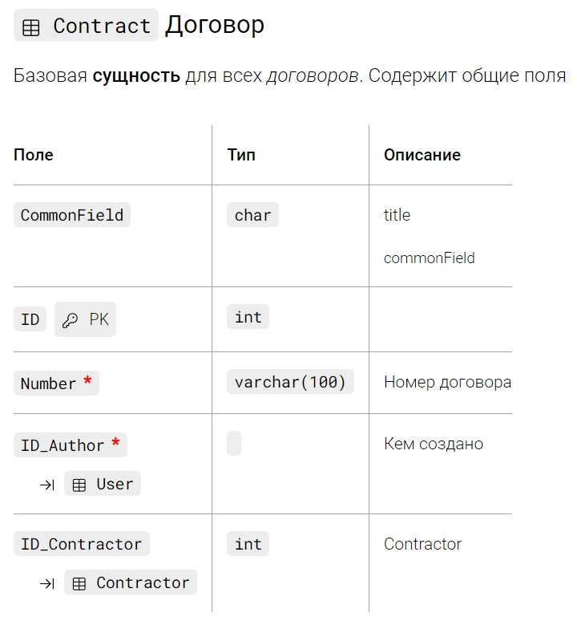

*  

   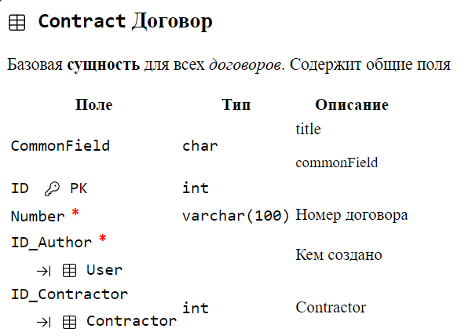

---

*  

   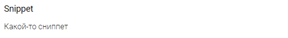

*  

   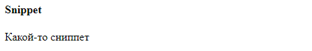

---

*  

   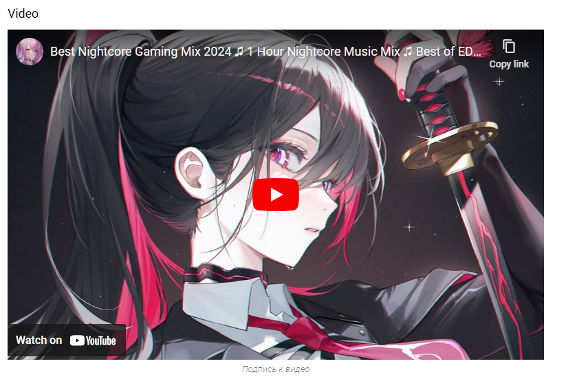

*  

   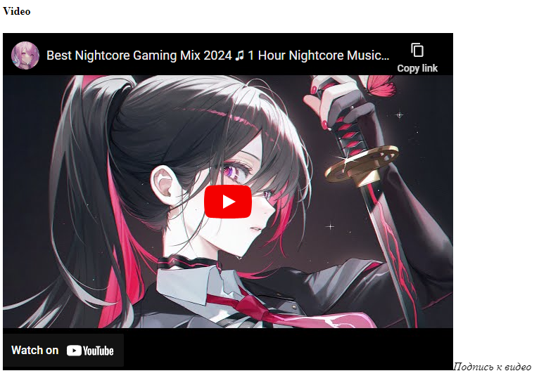

---

*  

   

*  

   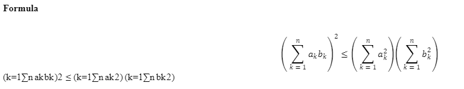

---

*  

   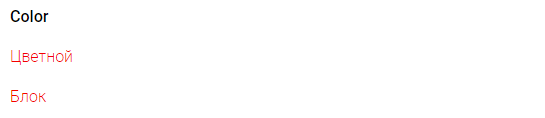

*  

   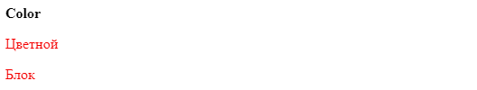

---

*  

   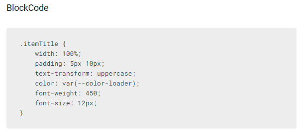

*  

   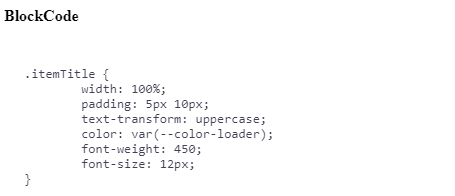

---

*  

   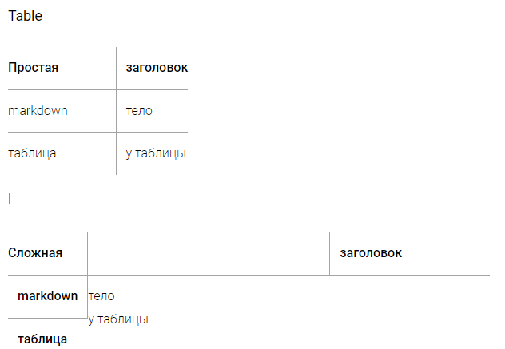

*  

   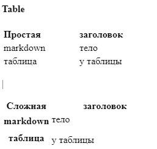

---

*  

   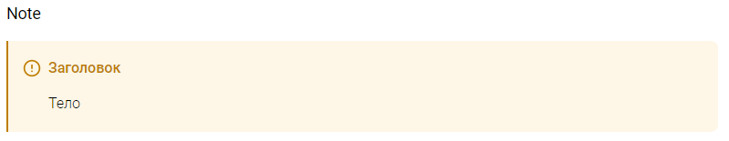

*  

   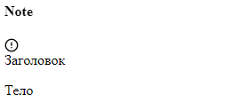

---

*  

   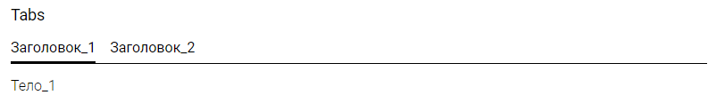

*  

   ")

---

*  

   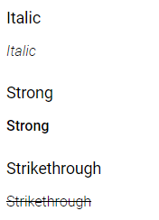

*  

   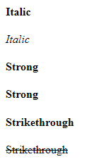

---

*  

   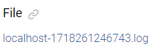

*  

   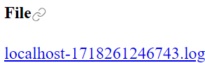

---

*  

   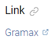

*  

   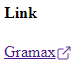

---

*  

   

*  

   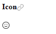

---

*  

   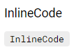

*  

   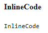

---

*  

   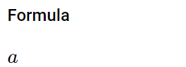

*  

   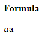

---

*  

   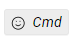

*  

   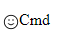

---

*  

   

*  

   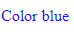

---

*  

   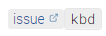

*  

   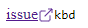

---

*  

   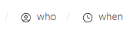

*  

   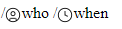

---

*  

   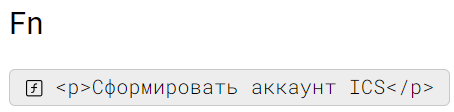

*  

   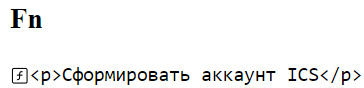

---

*  

   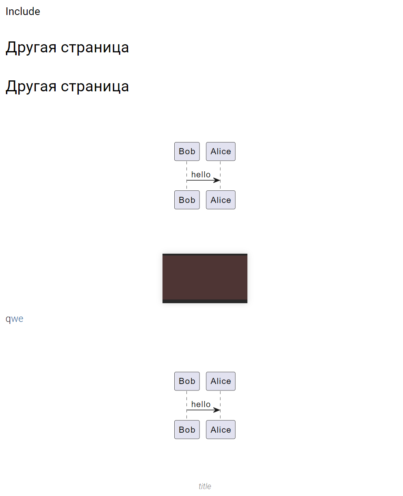

*  

   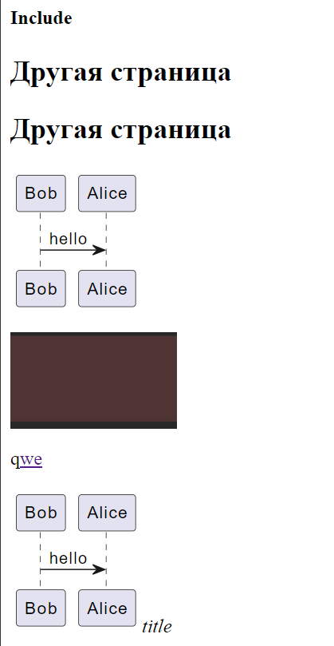



```
<name attr-name-1="value1" attr-name-2="value2" src={апи запрос, по котрому можно получить этот ресурс}>
	content
</name>
```

-  OpenApi (yaml)

   ```
   <open-api src={src}>
   </open-api>
   ```

-  Mermaid (mermaid)

   ```
   <mermaid src={src}>
   </mermaid>
   ```

-  C4 Structurizr  (c4)

   ```
   <c4-structurizr src={src}>
   </c4-structurizr>
   ```

-  TS-диаграммы

   ```
   <ts-diagram src={src}>
   </ts-diagram>
   ```

-  Tabs

   ```
   <tabs>
   	<tab title="title1" icon="icon2">
   		children1
   	</tab>
   	<tab title="title2" icon="icon2">
   		children2
   	</tab>
   </tabs>
   ```

-  PlantUML

   -  если контент в файле

      ```
      <plant-uml src={src}>
      </plant-uml>
      ```

   -  если контент в статье

      ```
      <plant-uml>
      	content
      </plant-uml>
      ```