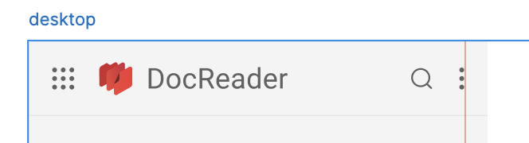
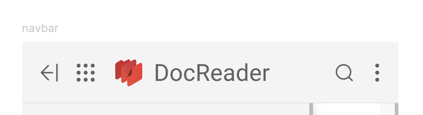
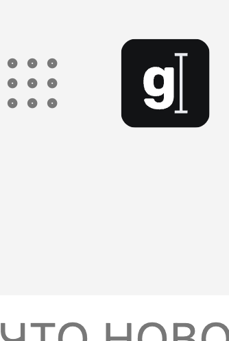
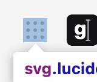

Старая шапка уже устарела, хотелось бы ее освежить.

## Критерии

-  Новая шапка выглядит вот так в десктопе, только без троеточия

   

-  Новая шапка выглядит вот так в мобильно версии, только без троеточия

   

разделитель в мобиле

тултипы в декстопе

убрать отступ сверху

Отступ у иконки Домой левый лишний есть, которого не должно быть. Исправьте пж

Вижу у иконки есть внутренний отступ. Придется похоже его вручную компенсировать за счет отрицательного маржина

## Детали

-  Полный дизайн можно посмотреть [тут](https://www.figma.com/design/4ed1wT5Q53Q2ngP4Oex7f8/Gramax-приложение?node-id=1872-6474&t=cY6fq1tNLQHQCIO9-0).