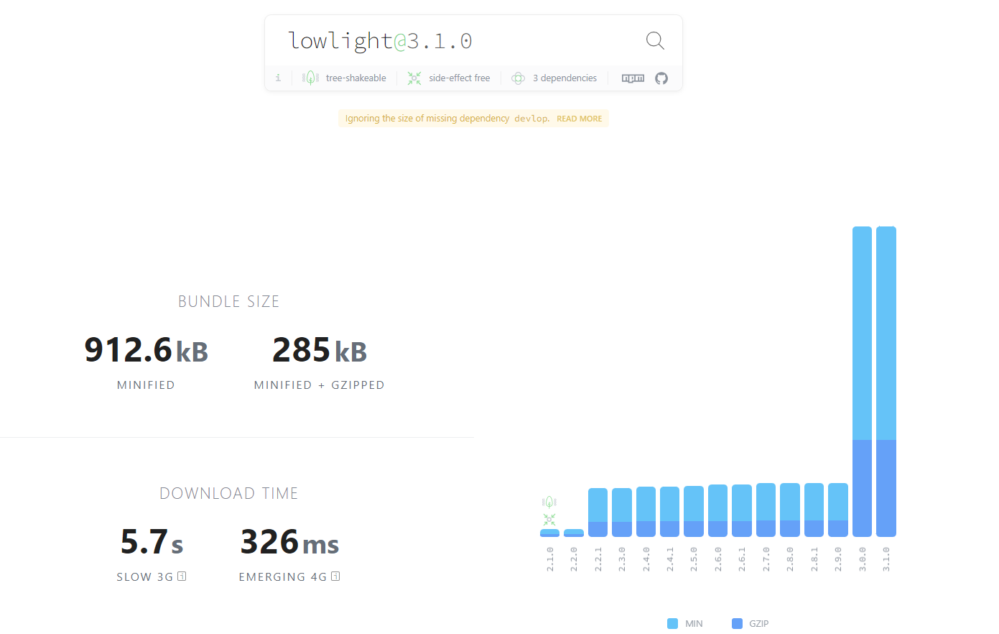
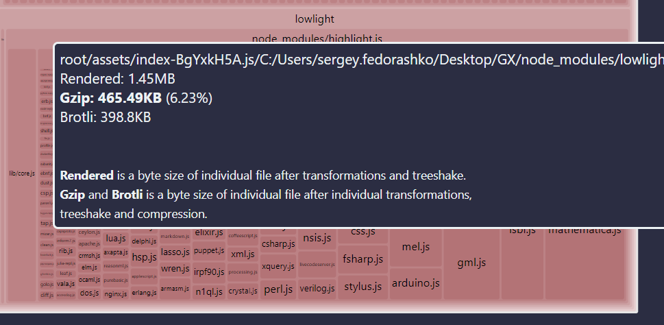
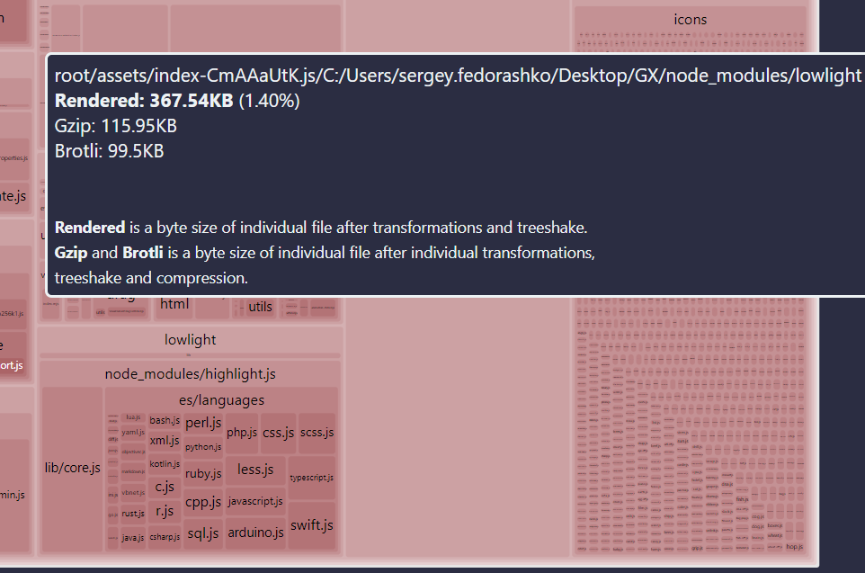

Сейчас нет подсветки синтаксиса в текущем блоке кода, хотелось бы использовать новое расширение блока кода для TipTap, которое поддерживает подсветку.

## Критерии приемки

1. В панели блока кода добавлен инпут с поиском, для выбора языка.

2. По клику в инпут, появляется выпадающее меню с перечнем языков.

   1. При удалении языка в инпуте, язык будет удален из блока кода.

   2. Используется поиск, как в других элементах (можно искать в неправильной раскладке и транслитом).

3. [Подсветка](https://embed.tiptap.dev/src/nodes/codeblocklowlight/react/) синтаксиса работает в приложении и на портале.

   1. Если язык не выбран, подсветка работать не будет.

## Техническая реализация

Для работы подсветки нужна библиотека lowlight:

-  Размер пакета в gzip для библиотеки lowlight:

   1. ver. 3.1.0 - **285kB**;

-  Размер пакта в gzip для блока кода:

   -  `@tiptap/extension-code-block-lowlight` - **8\.5kB**.

   -  `@tiptap/extension-code-block` - **1\.4kB**.

   -  `hast-util-to-jsx-runtime` - **9\.7kB**.

-  Используется пакет  `@tiptap/extension-code-block-lowlight` вместо текущей реализации блока кода

## Исходное пожелание

-  Юзер не понял, что у нас есть блок кода. Написал, что “не поддерживается многострочный код”.

-  До сих пор у нас очень плохой выход из инлайн блока кода. Андрей делал где-то реализацию уже. Надо найти и сделать.

-  Можно написать текстом какой язык используется, но никакой подсветки нет. Да и перечня языков нет.

## Оценка:

-  анализ: 2ч;

-  реализация: 16ч;

## Реальность

-  анализ: 2ч;

-  реализация 34ч;

:::note:true Размер пакета со всеми языками

:::

:::note:true Размер пакета со «common» языками

## 

:::