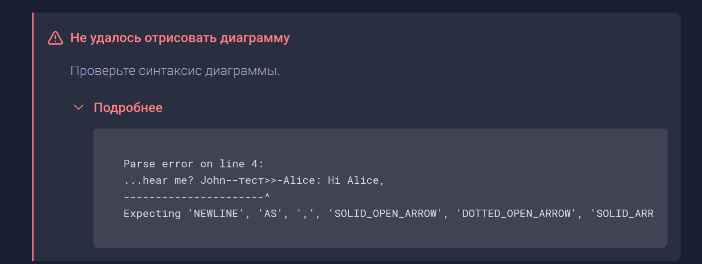

Сейчас не особо понятно из-за какой ошибки отваливаются mermaid диаграммы и из-за этого пользователям тяжело понять почему не рендерится его диаграмма. Нужно чтобы пользователи могли видеть причину из-за которой грамакс не смог отрисовать диаграмму.

## Критерии приемки

-  В блоке ошибки диаграммы показана причина почему грамакс не может отрисовать диаграмму

   

-  Убраны ошибки, которые указывают сразу на проблемы с интернетом и синтаксисом

## Оценка

-  Анализ: 1ч

-  Реализация: 4ч

## Исходная заявка

-  [GXS-1730 Устаревший текст ошибки](https://support.ics-it.ru/issue/GXS-1730)