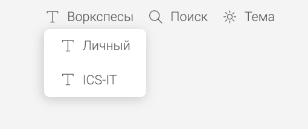

Сейчас пользователи энтерпрайз-версии могут использовать только `opensource` версию приложения. Нужно, чтобы из `opensource` версии можно было войти в энтерпрайз и получить все необходимые возможности.


**Выбранные хранилища используются во всех вокрспейсах**

## Критерии

1. В браузерной версии приложения есть кнопка “Вход для бизнеса”.

2. При нажатии на нее появляется форма, в которую нужно ввести почту.

   1. Заголовок: Вход для бизнеса

   2. Название поля: Почта

   3. Кнопка: Войти

      1. Почта не указана. Кнопка “Войти” заблокирована.

      2. В поле введена не почта. Кнопка “Войти” заблокирована. Над полем показывается тултип “Указана некорректная почта“.

      3. В поле ввели почту у которой нет существующей лицензии. Кнопка “Войти” заблокирована. Над полем показывается тултип: “Пользователь не найден. Укажите другую почту или продолжите использовать приложение без авторизации“.

      [image:./dobavlenie-knopki-vkhod-v-prilozhenie-4.png:::1.78642,4.35868,96.5633,86.5576:]

3. Если почта указана верно, кнопка “Войти" становится доступна. При клике пользователя перекидывает в SSO.

4. Если успешно залогинился, его перекидывает на [app.gram.ax](http://app.gram.ax).

5. После входа через SSO проверяется, является ли пользователь редактором

   1. Если он не редактор. Выводится ошибка:

      1. Заголовок: Доступ ограничен

      2. Текст: Убедитесь, что вам выдана лицензия редактора.

      3. Кнопка: Понятно

   2. Если редактор. Добавляется новое пространство и пользователя перекидывает в него. Также на главной появляется переключатель пространств который выглядит так.

      1. Заголовок: Пространства

      2. Иконка: [https://lucide.dev/icons/layers-3 ](https://lucide.dev/icons/layers-3)

      3. У пунктов нет иконок

         

6. При нажатии на кнопку “Выйти” проверяется, есть ли у него неопубликованные изменения.

   1. Если нет изменений. Просто выходим.

   2. Если есть изменения. Показывается окно:

      1. Заголовок: Не удалось выйти из учетной записи

      2. Текст: У вас есть неопубликованные изменения в каталогах:

         1. [comment:4]Name[/comment]

         2. Name

            Опубликуйте их, чтобы выйти из учетной записи.

      3. Кнопка: Понятно

7. После выхода пространство пропадает из списка пространств. Каталоги из него скрываются в приложении, но остаются в памяти браузера или локально.

8. В корпоративном пространстве будут применены настройки, которые указаны в `GES`. Добавляются новые настройки доступные только в enterprise пространстве

   ```
   groups:
      products:
         title: Продукты и сервисы
         style: big # По дефолту берется со основного style
      company:
         title: Внутренняя документация
         title: Проекты
   
   name: ics-it # Название воркспейса
   storage: # Настройки хранилища и дефолтных каталогов, обязательный параметр
      type: gitlab
      domain: gitlab.ics-it.ru
      repos:
         - ics/gramax
         - ics/docs
   ```

## Оценка

-  Анализ -- 6ч

-  Реализация -- 3дня

## Технические детали

1. Веб-редактор

   1. При нажатии на кнопку войти. Пользователь вводит почту, мы отправляем запрос на `GLS/get-GES`.

      1. Если URL GES получен, пользователь нажимает на войти и его перекидывает на `GES/sso/login`. Иначе кнопка войти заблокирована с ошибкой `Пользователь не найден. Укажите другую почту или продолжите использовать приложение без авторизации.`

      2. Если успешно залогинился, его перекидывает на [app.gram.ax](http://app.gram.ax) c `query` в котором содержатся почта пользователя и URL GES. Сохраняем их в куки.

      3. И отправляем запрос на `GES/license/check-editor`.

      4. Если все ок, то ничего не делаем. Иначе ругаемся и говорим что он не редактор, и удаляем логин куки.

      5. Если инфа о пользователе есть то отправляем запрос на `GES/workspace`. И получаем всю инфу о `workspace`’е.

         1. Добавляем новый `workspace`

         2. После чего появляется кнопка переключения `workspace`’ов

         3. После чего его перекидывает на вход в их корпоративное хранилище (первым этапом, потом посмотрим можно ли автоматом это как-нибудь сделать)

         4. Механизм работы с `workspace`. Это просто какая-то настройка главной страницы и жесткое определение хранилища

            :::hotfixes:true Workspace

            ```
            ics-it:
              logo: https://3333
              logo_dark: https://3333
              style: small # По дефолту big
              storage:
                type: gitlab
                domain: gitlab.ics-it.ru
              groups:
                products:
                  title: Продукты и сервисы
                  style: big # По дефолту берется со основного style
                  default: true
                company:
                  title: Внутренняя документация
                projects:
                  title: Проекты
              repos:
                - ics/gramax
                - ics/docs
            ```

            :::

   2. При любом действии с `GitServer` проверяем лицензию редактора отправляя запрос на `GES/license/check-editor`.

      1. Если все ок, ничего не делаем. Если нет, то запрещаем выполнять никакие действия с `GitServer`

   3. При нажатии на кнопку выйти перенаправляет на `GES/sso/logout`,

      1. Надо проверить есть ли у него неопубликованные изменения

         1. Если все их нет, ничего не делаем

         2. Иначе, говорим пользователю `“У вас есть неопубликованные изменения. Опубликуйте их, чтобы выйти из учетной записи.“` . И кнопка `“Понятно”`.

      2. Удалить `workspace`, но каталоги оставить

2. Доработка докпортала.

   1. При нажатии на кнопку войти. Отправляет запрос на `GES/sso/login`, добавляем куки.

   2. При нажатии на кнопку выйти перенаправляет на `GES/sso/logout`, и очищает все куки.