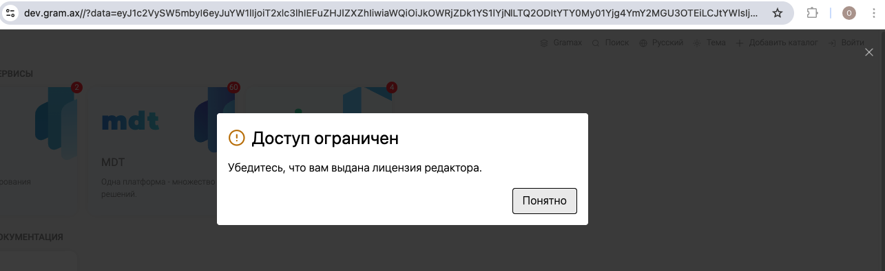

Сейчас у нас в компании используется опенсурсная версия и поэтому мы не можем использовать воркспейсы в браузерной/десктопной версии приложения. Надо добавить возможность использовать энтерпрайз фичи в браузерном приложении.

## Критерии приемки

-  В браузерном редакторе [dev.gram.ax](https://dev.gram.ax/) можно зайти в SSO и использовать фичи энтерпрайз приложения (группировка каталогов, добавление воркспейсов при входе, переключатель воркспейсов).

-  В докпортале [alfa-ics-it.gram.ax](https://alfa-ics-it.gram.ax/) можно использовать вход через SSO.

## Оценка

-  Анализ - 4 часа.

-  Реализация - 1 день.

## Замечания

-  На деве после входа сбрасывается авторизация и появляется сообщение, что доступ ограничен. \
   И после при переключении воркспейсов появляется это сообщение.

   
